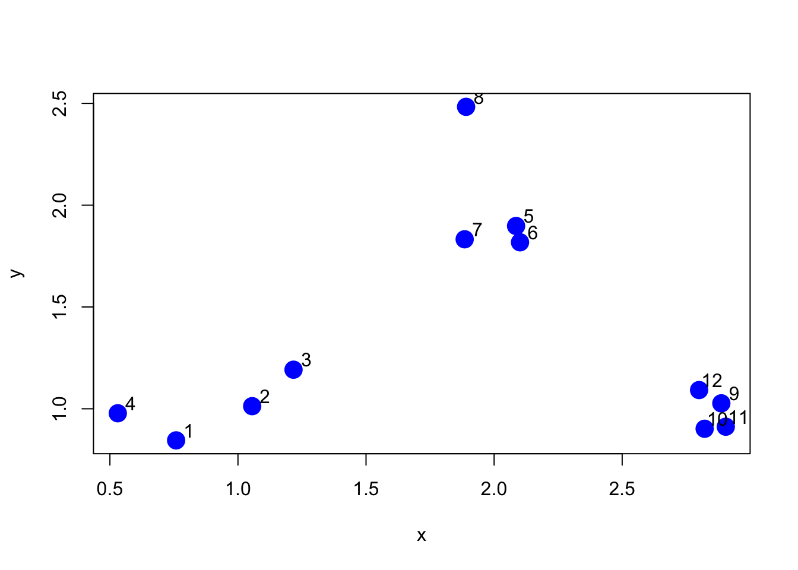
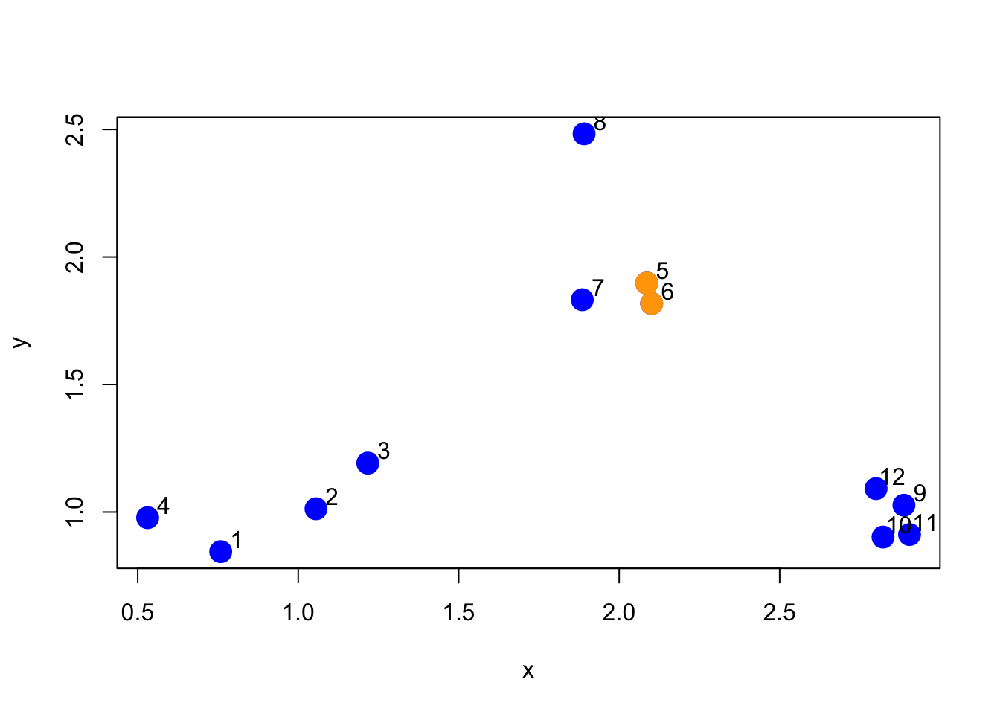
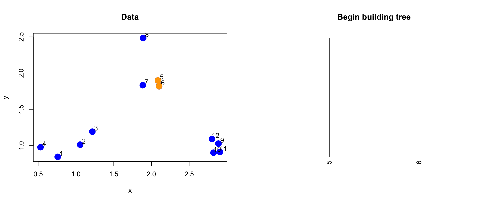
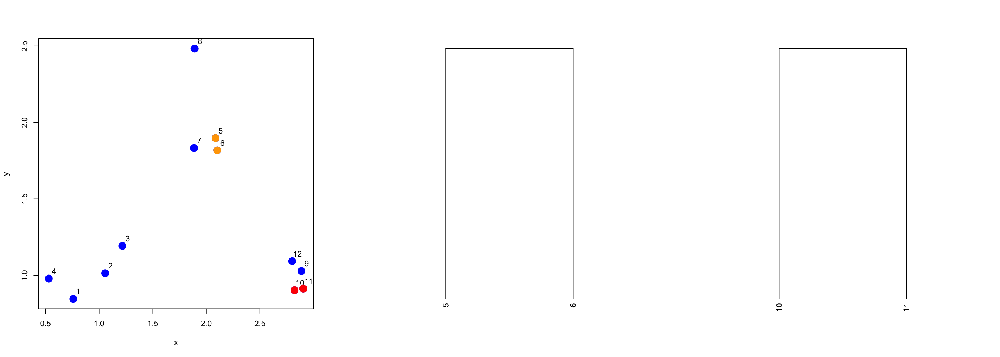
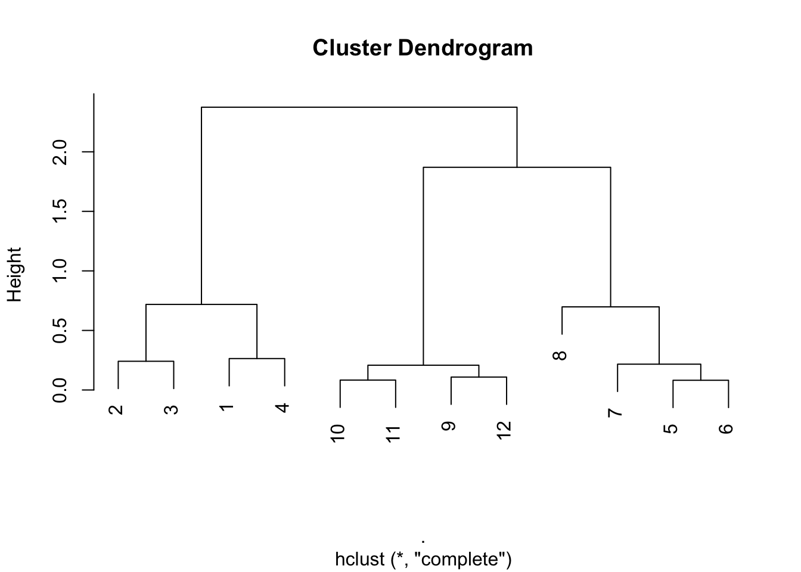
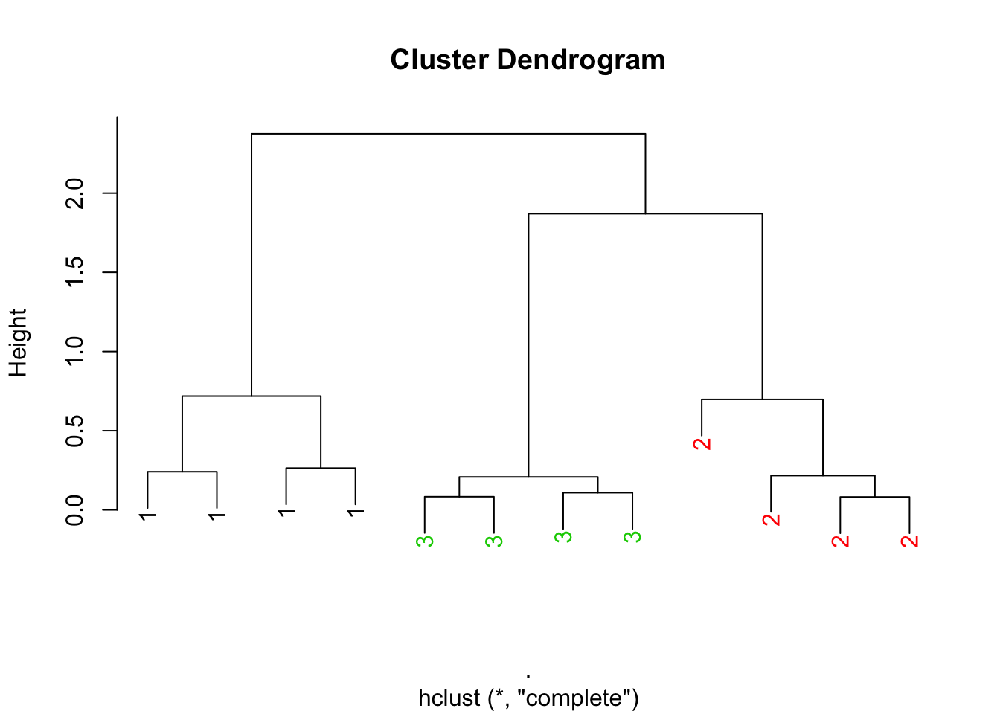
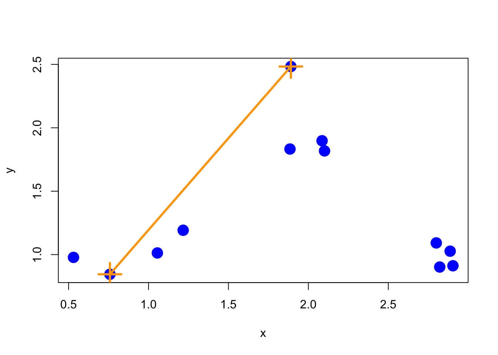
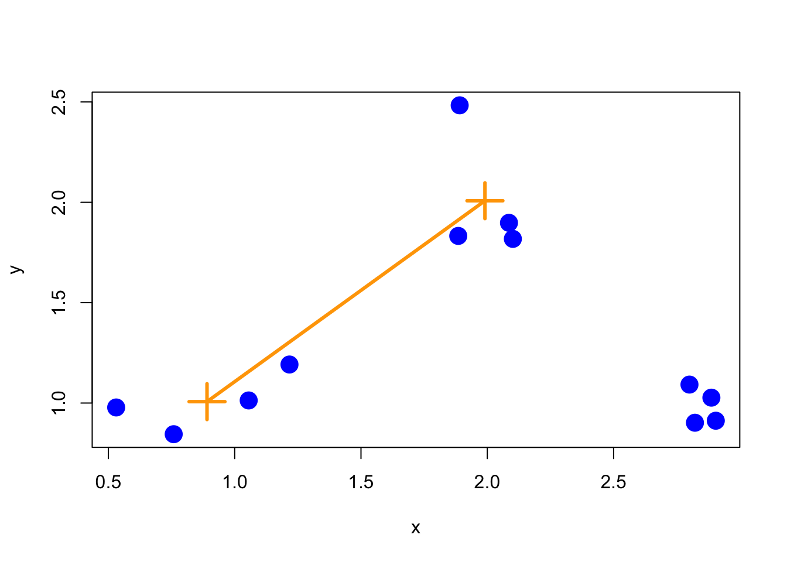
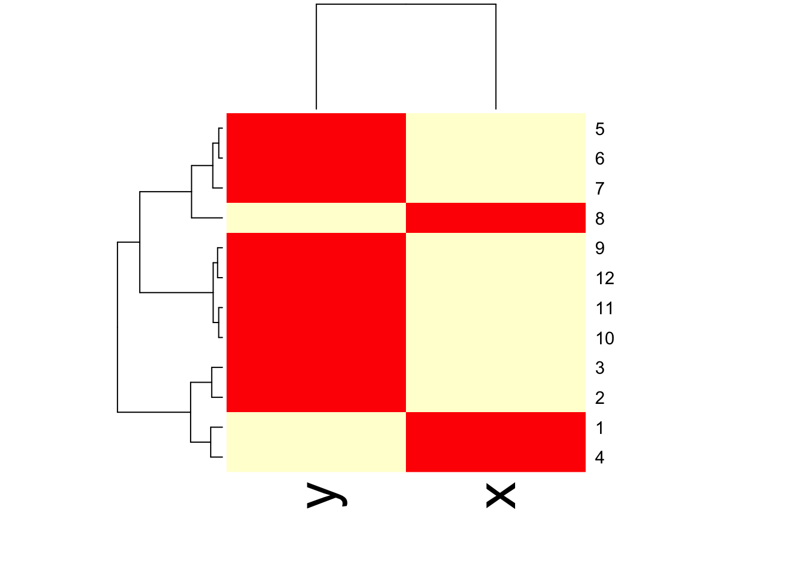

# Hierarchical Clustering


**Watch a video of this chapter**: [Part 1](https://youtu.be/BKoChxguelA) [Part 2](https://youtu.be/ZQYLGS7ptWM) [Part 3](https://youtu.be/lmSMEZAjE-4)

Clustering or cluster analysis is a bread and butter technique for visualizing high dimensional or multidimensional data. It's very simple to use, the ideas are fairly intuitive, and it can serve as a really quick way to get a sense of what's going on in a very high dimensional data set.

Cluster analysis is a really important and widely used technique. If you just type "cluster analysis" into Google, there are many millions of results that come back. 


And it's a widely applied method in many different areas of science, business, and other applications. So it's useful to know how these techniques work.

The point of clustering is to organize things or observations that are __close__ together and separate them into groups. Of course, this simple definition raises some immediate questions:

* How do we define close?

* How do we group things?

* How do we visualize the grouping? 

* How do we interpret the grouping? 

All clustering techniques confront a basic issue, which is how do we define when things are close
together and when things are far apart? Essentially, the wide variety of clustering techniques out there that you can apply to data differ in the ways that they answer these questions.

## Hierarchical clustering

Hierarchical clustering, as is denoted by the name, involves organizing your data into a kind of hierarchy. The common approach is what's called an agglomerative approach. This is a kind of bottom up approach, where you start by thinking of the data as individual data points. Then you start lumping them together into clusters little by little until eventually your entire data set is just one big cluster.

Imagine there's all these little particles floating around (your data points), and you start kind of grouping them together into little balls. And then the balls get grouped up into bigger balls, and the bigger balls get grouped together into one big massive cluster. That's the agglomerative
approach to clustering, and that's what we're going to talk about here.

The algorithm is recursive and goes as follows:

1. Find closest two things points in your dataset

2. Put them together and call them a "point"

3. Use your new "dataset" with this new point and repeat

This methodology requires that you have a way to measure the *distance* between two points and that you have an approach to *merging* two points to create a new "point". A benefit of this clustering methodology is that you can produce a tree showing how close things are to each other, which is simply a by product of running the algorithm.


## How do we define close?

Defining closeness is a key aspect of defining a clustering method. Ultimately, the old rule of "garbage in, garbage out" applies. If you don't use a distance metric that makes sense for your data, then you won't get any useful information out of the clustering.

There are a number of commonly used metrics for characterizing distance or its inverse, similarity:

* Euclidean distance: A continuous metric which can be thought of in geometric terms as the "straight-line" distance between two points.
  
* Correlation similarity: Similar in nature to Euclidean distance
  
* "Manhattan" distance: on a grid or lattice, how many "city blocks" would you have to travel to get from point A to point B?

The important thing is to always pick a distance or similarity metric that makes sense for your problem.

## Example: Euclidean distance


[source](http://rafalab.jhsph.edu/688/lec/lecture5-clustering.pdf)

For example,  take two cities, say, Baltimore and Washington D.C., and put them on a map. If you imagine that the center of each city has an X and a Y coordinate (say, longitude and latitude), and you want to map the distance between the centers of the two cities, then you can draw a straight diagonal line between the two cities. The distance can be calculated in the usual way, which is going to be a function of the difference in the x coordinates and the difference in
the y coordinates. In the two-dimensional plane, you take the distance in the x coordinates, square it, take the difference in the y coordinates, square that, and then add the two squares together and take the square root of the whole thing. In other words,

\[
Distance = [(X_1 - X_2)^2 + (Y_1 - Y_2)^2]^{1/2}
\]

That's the classical definition of Euclidian distance. You can imagine if a bird were to fly from Washington, D.C. to Baltimore, it would just fly straight from one city to another. This is possible because a bird isn't impeded by things like roads or mountains, or whatever. Whether that makes sense for you depends on, among other things, whether you're a bird or not. And so you have to think about the properties of this distance metric in the context of your problem.

One nice feature of Euclidean distance is that it's easily generalizable to higher dimensions. If instead of two dimensions you have 100 dimensions, you can easily take the differences between each of the 100 dimensions, square them, sum them together and then take the square root. So the Euclidean distance metric extends very naturally to very high dimensions problems.

In general the formula for Euclidean distance between point

\[
A = (A_1, A_2, \dots, A_n)
\]

and 

\[
B = (B_1, B_2, \dots, B_n)
\]

is

\[
Distance = ((A_1-B_1)^2 + (A_2-B_2)^2 + \cdots + (A_n-B_n)^2)^{(1/2)}
\]


## Example: Manhattan distance

The Manhattan distance gets its name from the idea that you can look at points as being on a grid or lattice, not unlike the grid making up the streets of Manhattan in New York City. 


In a city, if you want to go from point A to point B, you usually cannot take the direct route there because there will be buildings in the way. So instead, you have to follow the streets, or the grid layout, of the city to navigate around. That's the idea behind Manhattan distance

In the figure above, the red, blue, and yellow lines show various way of getting between the two black circles using the grid layout, while the green line shows the Euclidean distance. The Manhattan distance between the points is simply the sum of the right-left moves plus the sum of all the up-down moves on the grid.

In general:

\[
Distance = |A_1-B_1| + |A_2-B_2| + \cdots + |A_n-B_n|
\]

Check out Wikipedia's page on [taxicab geometry](http://en.wikipedia.org/wiki/Taxicab_geometry) for a fun diversion.


## Example: Hierarchical clustering

Here is a simple example demonstrating how hierarchical clustering works. First we'll simulate some data in three separate clusters. 


```r
> set.seed(1234)
> x <- rnorm(12, rep(1:3, each = 4), 0.2)
> y <- rnorm(12, rep(c(1, 2, 1), each = 4), 0.2)
> plot(x, y, col = "blue", pch = 19, cex = 2)
> text(x + 0.05, y + 0.05, labels = as.character(1:12))
```

<div class="figure">

<p class="caption">(\#fig:unnamed-chunk-2)Simulated clustered data</p>
</div>

The first step in the basic clustering approach is to calculate the distance between every point with every other point. The result is a *distance matrix*, which can be computed with the `dist()` function in R. 

Here is just a piece of the distance matrix associated with the figure above.


```r
> dataFrame <- data.frame(x=x, y=y)
> dist(dataFrame)
            1          2          3          4          5          6          7
2  0.34120511                                                                  
3  0.57493739 0.24102750                                                       
4  0.26381786 0.52578819 0.71861759                                            
5  1.69424700 1.35818182 1.11952883 1.80666768                                 
6  1.65812902 1.31960442 1.08338841 1.78081321 0.08150268                      
7  1.49823399 1.16620981 0.92568723 1.60131659 0.21110433 0.21666557           
8  1.99149025 1.69093111 1.45648906 2.02849490 0.61704200 0.69791931 0.65062566
9  2.13629539 1.83167669 1.67835968 2.35675598 1.18349654 1.11500116 1.28582631
10 2.06419586 1.76999236 1.63109790 2.29239480 1.23847877 1.16550201 1.32063059
11 2.14702468 1.85183204 1.71074417 2.37461984 1.28153948 1.21077373 1.37369662
12 2.05664233 1.74662555 1.58658782 2.27232243 1.07700974 1.00777231 1.17740375
            8          9         10         11
2                                             
3                                             
4                                             
5                                             
6                                             
7                                             
8                                             
9  1.76460709                                 
10 1.83517785 0.14090406                      
11 1.86999431 0.11624471 0.08317570           
12 1.66223814 0.10848966 0.19128645 0.20802789
```

The default distance metric used by the `dist()` function is Euclidean distance.

Note that usually you will *not* have to explicitly compute the distance matrix (unless you are inventing your own clustering method). Here I just print it out to show what's going on internally.

First an agglomerative clustering approach attempts to find the two points that are closest together. In other words, we want to find the smallest non-zero entry in the distance matrix.


```r
> rdistxy <- as.matrix(dist(dataFrame))
> 
> ## Remove the diagonal from consideration
> diag(rdistxy) <- diag(rdistxy) + 100000
> 
> # Find the index of the points with minimum distance
> ind <- which(rdistxy == min(rdistxy), arr.ind = TRUE)
> ind
  row col
6   6   5
5   5   6
```

Now we can plot the points and show which two points are closest together according to our distance metric.


```r
> plot(x, y, col = "blue", pch = 19, cex = 2)
> text(x + 0.05, y + 0.05, labels = as.character(1:12))
> points(x[ind[1, ]], y[ind[1, ]], col = "orange", pch = 19, cex = 2)
```

<div class="figure">

<p class="caption">(\#fig:unnamed-chunk-5)Two closest points</p>
</div>

The next step for the algorithm is to start drawing the tree, the first step of which would be to "merge" these two points together.


```r
> par(mfrow = c(1, 2))
> plot(x, y, col = "blue", pch = 19, cex = 2, main = "Data")
> text(x + 0.05, y + 0.05, labels = as.character(1:12))
> points(x[ind[1, ]], y[ind[1, ]], col = "orange", pch = 19, cex = 2)
> 
> # Make a cluster and cut it at the right height
> library(dplyr)
> hcluster <- dist(dataFrame) %>% hclust
> dendro <- as.dendrogram(hcluster)
> cutDendro <- cut(dendro, h = (hcluster$height[1] + 0.00001))
> plot(cutDendro$lower[[11]], yaxt = "n", main = "Begin building tree")
```

<div class="figure">

<p class="caption">(\#fig:unnamed-chunk-6)Merging of first two points</p>
</div>


Now that we've merged the first two "leaves" of this tree, we can turn the algorithm crank and continue to build the tree. Now, the two points we identified in the previous iteration will get "merged" into a single point, as depicted below.

<div class="figure">

<p class="caption">(\#fig:unnamed-chunk-7)First set of merged points/cluster</p>
</div>


We need to search the distance matrix for the *next* two closest points, ignoring the first two that we already merged.


```r
> nextmin <- rdistxy[order(rdistxy)][3]
> ind <- which(rdistxy == nextmin,arr.ind=TRUE)
> ind
   row col
11  11  10
10  10  11
```

Now we can plot the data with this next pair of points and the merged tree leaves.

<div class="figure">

<p class="caption">(\#fig:unnamed-chunk-9)Second set of merged points</p>
</div>

And on and on in this manner. If we were to continue in this fashion--identifying the two closest points and merging them, we'd end up with a *dendrogram* that looks like this one. Here, we call the `hclust()` do run the clustering algorithm.


```r
> hClustering <- data.frame(x=x,y=y) %>% dist %>% hclust
> plot(hClustering)
```

<div class="figure">

<p class="caption">(\#fig:unnamed-chunk-10)Full hierarchical clustering dendrogram</p>
</div>

From the tree/dendrogram it's clear that there are three clusters each with four points. 


## Prettier dendrograms

It's possible to make slightly prettier dendrograms with some modification to the usual plotting method for the output of `hclust()`. Here's a function that takes the output of `hclust()` and color codes each of the cluster members by their cluster membership.


```r
> myplclust <- function(hclust, lab = hclust$labels, lab.col = rep(1, length(hclust$labels)), 
+     hang = 0.1, ...) {
+     ## modifiction of plclust for plotting hclust objects *in colour*!  Copyright Eva
+     ## KF Chan 2009 Arguments: hclust: hclust object lab: a character vector of labels
+     ## of the leaves of the tree lab.col: colour for the labels; NA=default device
+     ## foreground colour hang: as in hclust & plclust Side effect: A display of
+     ## hierarchical cluster with coloured leaf labels.
+     y <- rep(hclust$height, 2)
+     x <- as.numeric(hclust$merge)
+     y <- y[which(x < 0)]
+     x <- x[which(x < 0)]
+     x <- abs(x)
+     y <- y[order(x)]
+     x <- x[order(x)]
+     plot(hclust, labels = FALSE, hang = hang, ...)
+     text(x = x, y = y[hclust$order] - (max(hclust$height) * hang), labels = lab[hclust$order], 
+         col = lab.col[hclust$order], srt = 90, adj = c(1, 0.5), xpd = NA, ...)
+ }
```

And here's the output the function produces.


```r
> hClustering <- data.frame(x = x, y = y) %>% dist %>% hclust
> myplclust(hClustering, lab = rep(1:3, each = 4), lab.col = rep(1:3, each = 4))
```

<div class="figure">

<p class="caption">(\#fig:unnamed-chunk-11)Prettier dendrogram</p>
</div>


## Merging points: Complete

One issue that we haven't discussed yet is how exactly the merging of clusters works. Recall that once we find the two points that are closest together, we "merge" them and then consider the merged pair as a single "point". When we compare this merged "point" with other points, how should we measure the distance from one point to this merged cluster of points? 

One method, called "complete" is to measure the distance between two groups of points by the maximun distance between the two groups. That is, take all points in group 1 and all points in group 2 and find the two points that are *furthest* apart--that's the distance between the groups. 

Here's what that would look like with our simulated data.

<div class="figure">

<p class="caption">(\#fig:unnamed-chunk-12)Complete merging</p>
</div>

Complete merging is the default method in the `hclust()` function.

## Merging points: Average

Another approach is average merging, which takes the average of the coordinate values in each group and measures the distance between these two averages. That approach is shown below.

<div class="figure">

<p class="caption">(\#fig:unnamed-chunk-13)Average merging</p>
</div>

While there's not necessarily a correct merging approach for any given application, it's important to note that the resulting tree/hierarchy that you get can be sensitive to the merging approach that you use.


## Using the `heatmap()` function

The `heatmap()` function is a handy way to visualize matrix data. The basic idea is that `heatmap()` sorts the rows and columns of a matrix according to the clustering determined by a call to `hclust()`. Conceptually, `heatmap()` first treats the rows of a matrix as observations and calls `hclust()` on them, then it treats the columns of a matrix as observations and calls `hclust()` on those values. The end result is that you get a dendrogram associated with both the rows and columns of a matrix, which can help you to spot obvious patterns in the data.


```r
> dataMatrix <- data.frame(x=x,y=y) %>% data.matrix
> heatmap(dataMatrix)
```

<div class="figure">

<p class="caption">(\#fig:unnamed-chunk-14)Heatmap with dendrograms on rows and columns</p>
</div>


## Notes and further resources


Hierarchical clustering is a really useful tool because it quickly gives you an idea of the relationships between variables/observations. But caution should be used with clustering as often the picture that you produce can be unstable. In particular, it may be sensitive to
  
  * Changing a few points in the dataset
  
  * Having different missing values in some of the observations
  
  * Picking a different distance metric (i.e. Euclidean vs. Manhattan)
  
  * Changing the merging strategy (i.e. complete vs. average)
  
  * Changing the scale of points for one variable

Another issue is that choosing where to "cut" the tree to determine the number of clusters isn't always obvious. In light of some of these limitations, hierarchical clustering should be primarily used for exploration of data. Once major patterns have been identified, it's often best to delve further with other tools and formal modeling.

Some other resources to check out:

* [Rafa's Distances and Clustering Video](http://www.youtube.com/watch?v=wQhVWUcXM0A)

* [Elements of statistical learning](http://www-stat.stanford.edu/~tibs/ElemStatLearn/)


