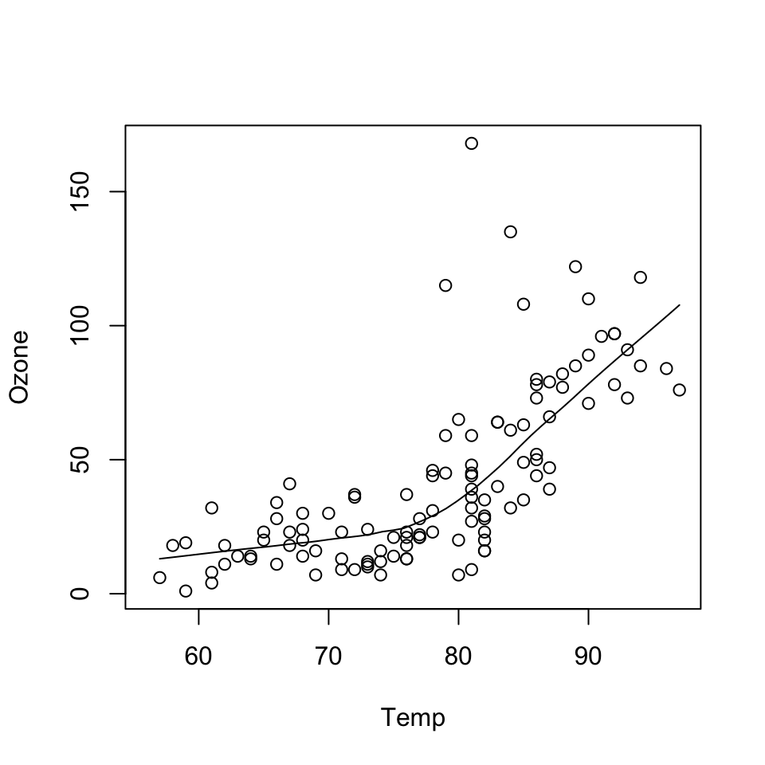
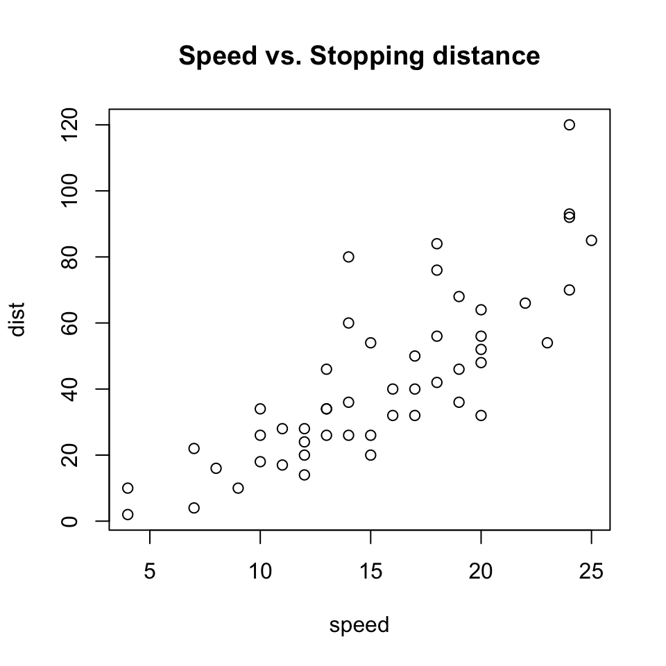
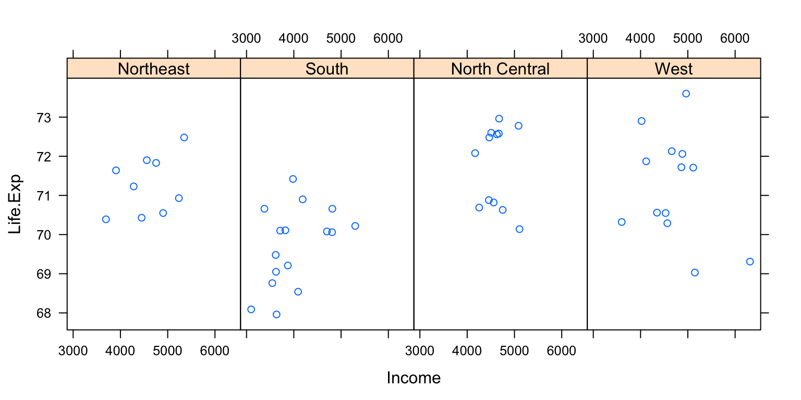
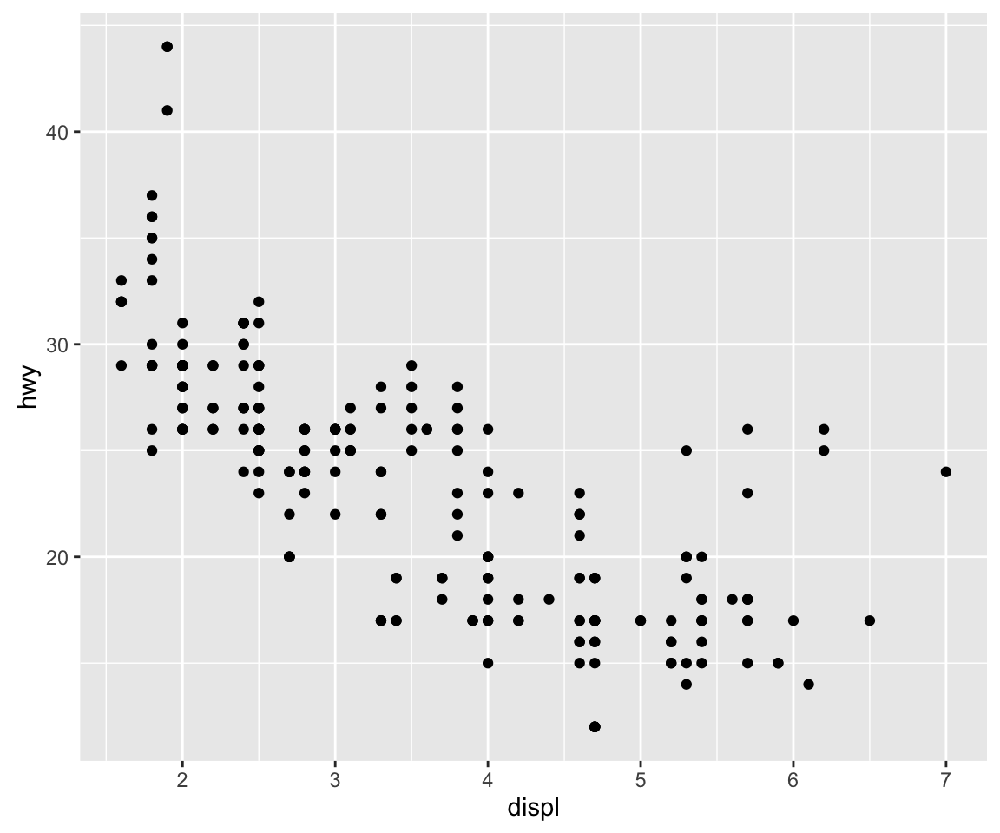

# Plotting Systems

[Watch a video of this chapter](https://youtu.be/a4mvbyNGdBA).

There are three different plotting systems in R and they each have different characteristics and modes of operation. They three systems are the base plotting system, the lattice system, and the ggplot2 system. This chapter (and this book) will focus primarily on the base plotting system.


## The Base Plotting System

The base plotting system is the original plotting system for R. The basic model is sometimes referred to as the "artist's palette" model. The idea is you start with blank canvas and build up from there. 

In more R-specific terms, you typically start with `plot` function (or similar plot creating function) to *initiate* a plot and then *annotate* the plot with various annotation functions (`text`, `lines`, `points`, `axis`)

The base plotting system is often the most convenient plotting system to use because it mirrors how we sometimes think of building plots and analyzing data. If we don't have a completely well-formed idea of how we want to look at some data, often we'll start by "throwing some data on the page" and then slowly add more information to it as our thought process evolves. 

For example, we might look at a simple scatterplot and then decide to add a linear regression line or a smoother to it to highlight the trends.


```r
> data(airquality)
> with(airquality, {
+         plot(Temp, Ozone)
+         lines(loess.smooth(Temp, Ozone))
+ })
```

<div class="figure">

<p class="caption">(\#fig:unnamed-chunk-2)Scatterplot with loess curve</p>
</div>

In the code above, the `plot` function creates the initial plot and draws the points (circles) on the canvas. The `lines` function is used to annotate or add to the plot; in this case it adds a loess smoother to the scatterplot.

Here we use the `plot` function to draw the points on the scatterplot and then use the `title` function to add a main title to the plot. 

One downside with constructing base plots is that you can’t go backwards once the plot has started. So it's possible that you could start down the road of constructing a plot and realize later (when it's too late) that you don't have enough room to add a y-axis label or something like that.

If you have specific plot in mind, there is then a need to plan in advance to make sure, for example, that you've set your margins to be the right size to fit all of the annotations that you may want to include. While the base plotting system is nice in that it gives you the flexibility to specify these kinds of details to painstaking accuracy, sometimes it would be nice if the system could just figure it out for you.

Another downside of the base plotting system is that it's difficult to describe or translate a plot to others because there's no clear graphical language or grammar that can be used to communicate what you've done. The only real way to describe what you've done in a base plot is to just list the series of commands/functions that you've executed, which is not a particularly compact way of communicating things. This is one problem that the `ggplot2` package attempts to address.

Another typical base plot is constructed with the following code.


```r
> data(cars)
> 
> ## Create the plot / draw canvas
> with(cars, plot(speed, dist))
> 
> ## Add annotation
> title("Speed vs. Stopping distance")
```

<div class="figure">

<p class="caption">(\#fig:unnamed-chunk-3)Base plot with title</p>
</div>

We will go into more detail on what these functions do in later chapters.


## The Lattice System

The lattice plotting system is implemented in the `lattice` package which comes with every installation of R (although it is not loaded by default). To use the lattice plotting functions you must first load the `lattice` package with the `library` function.


```r
> library(lattice)
```

With the lattice system, plots are created with a single function call, such as `xyplot` or `bwplot`. There is no real distinction between functions that create or initiate plots and functions that annotate plots because it all happens at once.

Lattice plots tend to be most useful for conditioning types of plots, i.e. looking at how y changes with x across levels of z. These types of plots are useful for looking at multi-dimensional data and often allow you to squeeze a lot of information into a single window or page.

Another aspect of lattice that makes it different from base plotting is that things like margins and spacing are set automatically. This is possible because entire plot is specified at once via a single function call, so all of the available information needed to figure out the spacing and margins is already there.

Here is an example of a lattice plot that looks at the relationship between life expectancy and income and how that relationship varies by region in the United States. 


```r
> state <- data.frame(state.x77, region = state.region)
> xyplot(Life.Exp ~ Income | region, data = state, layout = c(4, 1))
```

<div class="figure">

<p class="caption">(\#fig:unnamed-chunk-5)Lattice plot</p>
</div>

You can see that the entire plot was generated by the call to `xyplot` and all of the data for the plot were stored in the `state` data frame. The plot itself contains four panels---one for each region---and within each panel is a scatterplot of life expectancy and income. The notion of *panels* comes up a lot with lattice plots because you typically have many panels in a lattice plot (each panel typically represents a *condition*, like "region").


One downside with the lattice system is that it can sometimes be very awkward to specify an entire plot in a single function call (you end up with functions with many many arguments). Also, annotation in panels in plots is not especially intuitive and can be difficult to explain. In particular, the use of custom panel functions and subscripts can be difficult to wield and requires intense preparation. Finally, once a plot is created, you cannot "add" to the plot (but of course you can just make it again with modifications).


## The ggplot2 System

The ggplot2 plottings system attempts to split the difference between base and lattice in a number of ways. Taking cues from lattice, the ggplot2 system automatically deals with spacings, text, titles but also allows you to annotate by "adding" to a plot.

The ggplot2 system is implemented in the `ggplot2` package, which is available from CRAN (it does not come with R). You can install it from CRAN via


```r
> install.packages("ggplot2")
```

and then load it into R via the `library` function.


```r
> library(ggplot2)
```

Superficially, the ggplot2 functions are similar to lattice, but the system is  generally easier and more intuitive to use. The defaults used in ggplot2 make many choices for you, but you can still customize plots to your heart's desire.

A typical plot with the `ggplot` package looks as follows.


```r
> data(mpg)
> qplot(displ, hwy, data = mpg)
```

<div class="figure">

<p class="caption">(\#fig:unnamed-chunk-8)ggplot2 plot</p>
</div>

The `qplot` function in `ggplot2` is what you use to "quickly get some data on the screen". There are additional functions in `ggplot2` that allow you to make arbitrarily sophisticated plots.

## References

Paul Murrell (2011). *R Graphics*, CRC Press.

Hadley Wickham (2009). *ggplot2*, Springer.

Deepayan Sarkar (2008). *Lattice: Multivariate Data Visualization with R*, Springer.


