# Exploratory Graphs

Watch a video of this chapter: [Part 1](https://youtu.be/ma6-0PSNLHo) [Part 2](https://youtu.be/UyopqXQ8TTM)

There are many reasons to use graphics or plots in exploratory data analysis. If you just have a few data points, you might just print them out on the screen or on a sheet of paper and scan them over quickly before doing any real analysis (technique I commonly use for small datasets or subsets). If you have a dataset with more than just a few data points, then you'll typically need some assistance to visualize the data. 

Visualizing the data via graphics can be important at the beginning stages of data analysis to  understand basic properties of the data, to find simple patterns in data, and to suggest possible modeling strategies. In later stages of an analysis, graphics can be used to "debug" an analysis, if an unexpected (but not necessarily wrong) result occurs, or ultimately, to communicate your findings to others.

## Characteristics of exploratory graphs

For the purposes of this chapter (and the rest of this book), we will make a distinction between *exploratory* graphs and *final* graphs. This distinction is not a very formal one, but it serves to highlight the fact that graphs are used for many different purposes. Exploratory graphs are usually made very quickly and a lot of them are made in the process of checking out the data.

The goal of making exploratory graphs is usually developing a personal understanding of the data and to prioritize tasks for follow up. Details like axis orientation or legends, while present, are generally cleaned up and prettified if the graph is going to be used for communication later. Often color and plot symbol size are used to convey various dimensions of information.

## Air Pollution in the United States

For this chapter, we will use a simple case study to demonstrate the kinds of simple graphs that can be useful in exploratory analyses. The data we will be using come from the U.S. Environmental Protection Agency (EPA), which is the U.S. government agency that sets [national air quality standards for outdoor air pollution](http://www.epa.gov/air/criteria.html). One of the national ambient air quality standards in the U.S. concerns the long-term average level of fine particle pollution, also referred to as PM2.5. Here, the standard says that the "annual mean, averaged over 3 years" cannot exceed 12 micrograms per cubic meter. Data on daily PM2.5 are available from the U.S. EPA web site, or specifically, the [EPA Air Quality System](http://www.epa.gov/ttn/airs/airsaqs/detaildata/downloadaqsdata.htm) web site.

One key question we are interested is: **Are there any counties in the U.S. that exceed the national standard for fine particle pollution?** This question has important consequences because counties that are found to be in violation of the national standards can face serious legal consequences. In particular, states that have counties in violation of the standards are required to create a State Implementation Plan (SIP) that shows how those counties will come within the national standards within a given period of time.

## Getting the Data

First, we can read the data into R with `read.csv()`. This dataset contains the annual mean PM2.5 averaged over the period 2008 through 2010

~~~~~~~~
> class <- c("numeric", "character", "factor", "numeric", "numeric")
> pollution <- read.csv("data/avgpm25.csv", colClasses = class)
~~~~~~~~

Here are the first few rows of the data frame. 

~~~~~~~~
> head(pollution)
       pm25  fips region longitude latitude
1  9.771185 01003   east -87.74826 30.59278
2  9.993817 01027   east -85.84286 33.26581
3 10.688618 01033   east -87.72596 34.73148
4 11.337424 01049   east -85.79892 34.45913
5 12.119764 01055   east -86.03212 34.01860
6 10.827805 01069   east -85.35039 31.18973
~~~~~~~~

Each row contains the 5-digit code indicating the county (`fips`), the region of the country in which the county resides, the longitude and latitude of the centroid for that county, and the average PM2.5 level.

Here's a bit more information on the dataset as given by `str()`.

~~~~~~~~
> str(pollution)
'data.frame':	576 obs. of  5 variables:
 $ pm25     : num  9.77 9.99 10.69 11.34 12.12 ...
 $ fips     : chr  "01003" "01027" "01033" "01049" ...
 $ region   : Factor w/ 2 levels "east","west": 1 1 1 1 1 1 1 1 1 1 ...
 $ longitude: num  -87.7 -85.8 -87.7 -85.8 -86 ...
 $ latitude : num  30.6 33.3 34.7 34.5 34 ...
~~~~~~~~

Back to the question, though. How can we see if any counties exceed the standard of 12 micrograms per cubic meter?

## Simple Summaries: One Dimension

For one dimensional summarize, there are number of options in R.

* **Five-number summary**: This gives the minimum, 25th percentile, median, 75th percentile, maximum of the data and is quick check on the distribution of the data (see the `fivenum()`)

* **Boxplots**: Boxplots are a visual representation of the five-number summary plus a bit more information. In particular, boxplots commonly plot outliers that go beyond the bulk of the data. This is implemented via the `boxplot()` function

* **Barplot**: Barplots are useful for visualizing categorical data, with the number of entries for each category being proportional to the height of the bar. Think "pie chart" but actually useful. The barplot can be made with the `barplot()` function.

* **Histograms**: Histograms show the complete empirical distribution of the data, beyond the five data points shown by the boxplots. Here, you can easily check skewwness of the data, symmetry, multi-modality, and other features. The `hist()` function makes a histogram, and a handy function to go with it sometimes is the `rug()` function.

* **Density plot**: The `density()` function computes a non-parametric estimate of the distribution of a variables

## Five Number Summary

A five-number summary can be computed with the `fivenum()` function, which takes a vector of numbers as input. Here, we compute a five-number summary of the PM2.5 data in the pollution dataset.

~~~~~~~~
> fivenum(pollution$pm25)
[1]  3.382626  8.547590 10.046697 11.356829 18.440731
~~~~~~~~

We can see that the median across all the counties in the dataset is about 10 micrograms per cubic meter. 

For interactive work, it's often a bit nice to use the `summary()` function, which has a default method for numeric vectors.

~~~~~~~~
> summary(pollution$pm25)
   Min. 1st Qu.  Median    Mean 3rd Qu.    Max. 
  3.383   8.549  10.047   9.836  11.356  18.441 
~~~~~~~~

You'll notice that in addition to the five-number summary, the `summary()` function also adds the mean of the data, which can be compared to the median to identify any skewness in the data. Given that the mean is fairly close to the median, there doesn't appear to be a dramatic amount of skewness in the distribution of PM2.5 in this dataset.

## Boxplot

Here's a quick boxplot of the PM2.5 data. Note that in a boxplot, the "whiskers" that stick out above and below the box have a length of 1.5 times the *inter-quartile range*, or IQR, which is simply the distance from the bottom of the box to the top of the box. Anything beyond the whiskers is marked as an "outlier" and is plotted separately as an individual point.

~~~~~~~~
> boxplot(pollution$pm25, col = "blue")
~~~~~~~~

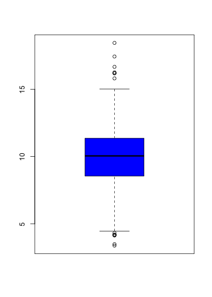

From the boxplot, we can see that there are a few points on both the high and the low end that appear to be outliers according to the `boxplot()` algorithm. These points migth be worth looking at individually. 

From the plot, it appears that the high points are all above the level of 15, so we can take a look at those data points directly. Note that although the current national ambient air quality standard is 12 micrograms per cubic meter, it used to be 15.

~~~~~~~~
> library(dplyr)
> filter(pollution, pm25 > 15)
      pm25  fips region longitude latitude
1 16.19452 06019   west -119.9035 36.63837
2 15.80378 06029   west -118.6833 35.29602
3 18.44073 06031   west -119.8113 36.15514
4 16.66180 06037   west -118.2342 34.08851
5 15.01573 06047   west -120.6741 37.24578
6 17.42905 06065   west -116.8036 33.78331
7 16.25190 06099   west -120.9588 37.61380
8 16.18358 06107   west -119.1661 36.23465
~~~~~~~~

These counties are all in the western U.S. (`region == west`) and in fact are all in California because the first two digits of the `fips` code are `06`.

We can make a quick map of these counties to get a sense of where they are in California.

~~~~~~~~
> library(maps)
> map("county", "california")
> with(filter(pollution, pm25 > 15), points(longitude, latitude))
~~~~~~~~

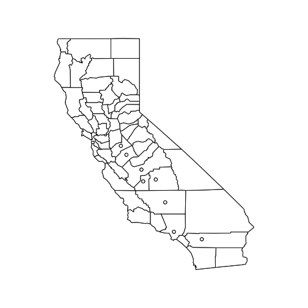

At this point, you might decide to follow up on these counties, or ignore them if you are interested in other features. Since these counties appear to have very high levels, relative to the distribution of levels in the other counties in the U.S., they may be worth following up on if you are interested in describing counties that are potentially in violation of the standards.

Note that the plot/map above is not very pretty, but it was made quickly and it gave us a sense of where these outlying counties were located and conveyed enough information to help decide if we an to follow up or not. 

## Histogram

A histogram is useful to look at when we want to see more detail on the full distribution of the data. The boxplot is quick and handy, but fundamentally only gives us a bit of information.

Here is a histogram of the PM2.5 annual average data.

~~~~~~~~
> hist(pollution$pm25, col = "green")
~~~~~~~~

This distribution is interesting because there appears to be a high concentration of counties in the neighborhood of 9 to 12 micrograms per cubic meter. We can get a little more detail of we use the `rug()` function to show us the actual data points.

~~~~~~~~
> hist(pollution$pm25, col = "green")
> rug(pollution$pm25)
~~~~~~~~

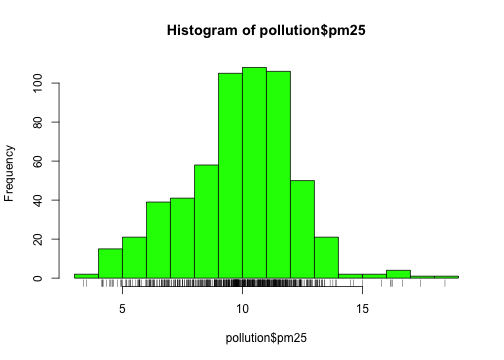

The large cluster of data points in the 9 to 12 range is perhaps not surprising in this context. It's not uncommon to observe this behavior in situations where you have a strict limit imposed at a certain level. Note that there are still quite a few counties above the level of 12, which may be worth investigating.

The `hist()` function has a default algorithm for determining the number of bars to use in the histogram based on the density of the data (see `?nclass.Sturges`). However, you can override the default option by setting the `breaks` argument to something else. Here, we use more bars to try to get more detail.

~~~~~~~~
> hist(pollution$pm25, col = "green", breaks = 100)
> rug(pollution$pm25)
~~~~~~~~

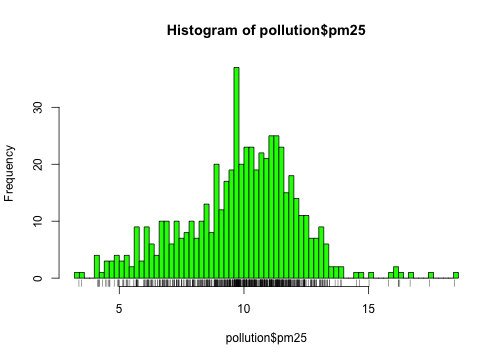

Now we see that there's a rather large spike 9 micrograms per cubic meter. It's not immediately clear why, but again, it might be worth following up on.

## Overlaying Features

Once we start seeing interesting features in our data, it's often useful to lay down annotations on our plots as reference points are markers. For example in our boxplot above, we might want to draw a horizontal line at 12 where the national standard is.

~~~~~~~~
> boxplot(pollution$pm25, col = "blue")
> abline(h = 12)
~~~~~~~~

We can see that a reasonable portion of the distribution as displayed by the boxplot is above the line (i.e. potentially in violation of the standard).

While the boxplot gives a sense, the histogram might be better suited to visualizing the data here. In the plot below, we see the histogram and draw two lines, one at the median of the data and one at 12, the level of the standard.

~~~~~~~~
> hist(pollution$pm25, col = "green")
> abline(v = 12, lwd = 2)
> abline(v = median(pollution$pm25), col = "magenta", lwd = 4)
~~~~~~~~

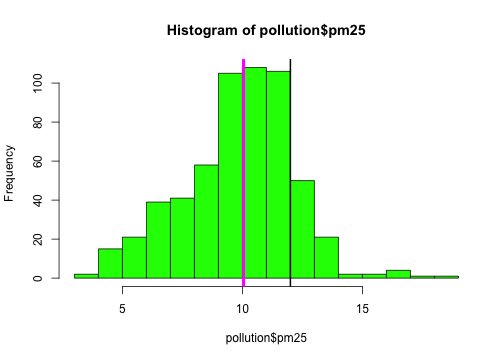

Note that for the vertical lines, we can use both color (`col`) and the line width (`lwd`) to indicate different components of information.

## Barplot

The barplot is useful for summarizing categorical data. Here we have one categorical variable, the region in which a county resides (east or west). We can see how many western and eastern counties there are with `barplot()`. We use the `table()` function to do the actual tabulation of how many counties there are in each region.

~~~~~~~~
> library(dplyr)
> table(pollution$region) %>% barplot(col = "wheat")
~~~~~~~~

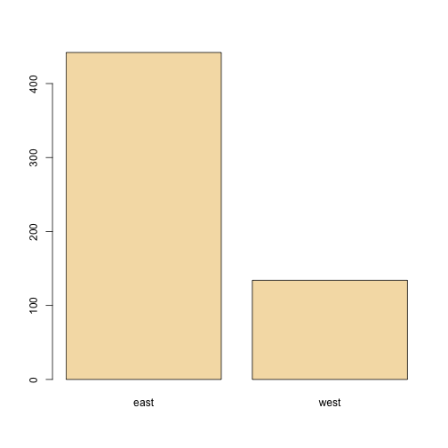

We can see quite clearly that there are many more counties in the eastern U.S. in this dataset than in the western U.S. 

## Simple Summaries: Two Dimensions and Beyond

So far we've covered some of the main tools used to summarize one dimensional data. For investigating data in two dimensions and beyond, there is an array of additional tools. Some of the key approaches are

* **Multiple or overlayed 1-D plots** (Lattice/ggplot2): Using multiple boxplots or multiple histograms can be useful for seeing the relationship between two variables, especially when on is naturally categorical.

* **Scatterplots**: Scatterplots are the natural tool for visualizing two continuous variables. Transformations of the variables (e.g. log or square-root transformation) may be necessary for effective visualization.

* **Smooth scatterplots**: Similar in concept to scatterplots but rather plots a 2-D histogram of the data. Can be useful for scatterplots that may contain many many data points.

For visualizing data in more than 2 dimensions, without resorting to 3-D animations (or glasses!), we can often combine the tools that we've already learned:

* **Overlayed or multiple 2-D plots; conditioning plots (coplots)**: A conditioning plot, or coplot, shows the relationship between two variables as a third (or more) variable changes. For example, you might want to see how the relationship between air pollution levels and mortality changes with the season of the year. Here, air pollution and mortality are the two primary variables and season is the third variable varying in the background.

* **Use color, size, shape to add dimensions**: Plotting points with different colors or shapes is useful for indicating a third dimension, where different colors can indicate different categories or ranges of something. Plotting symbols with different sizes can also achieve the same effect when the third dimension is continuous.

* **Spinning/interactive plots**: Spinning plots can be used to simulate 3-D plots by allowing the user to essentially quickly cycle through many different 2-D projections so that the plot feels 3-D. These are sometimes helpful to capture unusual structure in the data, but I rarely use them.

* **Actual 3-D plots (not that useful)**: Actual 3-D plots (for example, requiring 3-D glasses) are relatively few and far between and are generally impractical for communicating to a large audience. Of course, this may change in the future with improvements in technology....

## Multiple Boxplots

One of the simplest ways to show the relationship between two variables (in this case, one categorical and one continuous) is to show side-by-side boxplots. Using the pollution data described above, we can show the difference in PM2.5 levels between the eastern and western parts of the U.S. with the `boxplot()` function.

~~~~~~~~
> boxplot(pm25 ~ region, data = pollution, col = "red")
~~~~~~~~

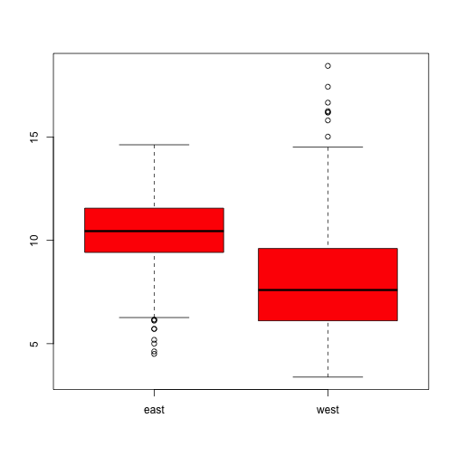

The `boxplot()` function can take a *formula*, with the left hand side indicating the variable for which we want to create the boxplot (continuous) and the right hand side indicating the variable that stratifies the left hand side into categories. Since the `region` variable only has two categories, we end up with two boxplots. Side-by-side boxplots are useful because you can often fit many on a page to get a rich sense of any trends or changes in a variable. Their compact format allow you to visualize a lot of data in a small space.

From the plot above, we can see rather clearly that the levels in eastern counties are on average higher than the levels in western counties.

## Multiple Histograms

It can sometimes be useful to plot multiple histograms, much like with side-by-side boxplots, to see changes in the shape of the distribution of a variable across different categories. However, the number of histograms that you can effectively put on a page is limited.

Here is the distribution of PM2.5 in the eastern and western regions of the U.S.

~~~~~~~~
> par(mfrow = c(2, 1), mar = c(4, 4, 2, 1))
> hist(subset(pollution, region == "east")$pm25, col = "green")
> hist(subset(pollution, region == "west")$pm25, col = "green")
~~~~~~~~

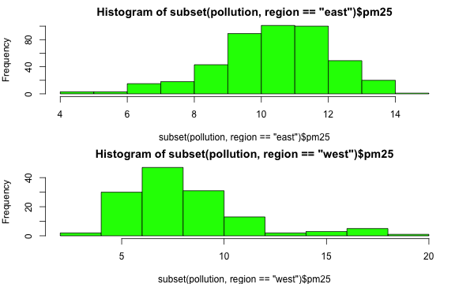

You can see here that the PM2.5 in the western U.S. tends to be right-skewed with some outlying counties with very high levels. The PM2.5 in the east tends to be left skewed some counties having very low levels.

## Scatterplots

For continuous variables, the most common visualization technique is the scatterplot, which simply maps each variable to an x- or y-axis coordinate. Here is a scatterplot of latitude and PM2.5, which can be made with the `plot()` function.

~~~~~~~~
> with(pollution, plot(latitude, pm25))
> abline(h = 12, lwd = 2, lty = 2)
~~~~~~~~

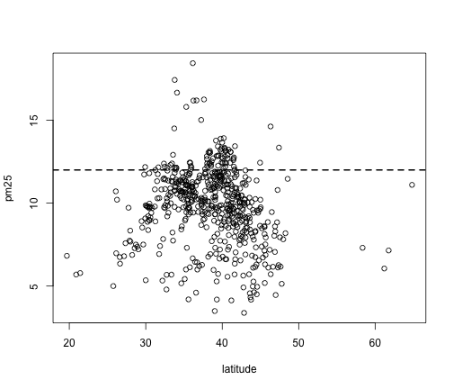

As you go from south to north in the U.S., we can see that the highest levels of PM2.5 tend to be in the middle region of the country.

## Scatterplot - Using Color

If we wanted to add a third dimension to the scatterplot above, say the `region` variable indicating east and west, we could use color to highlight that dimension. Here we color the circles in the plot to indicate east (black) or west (red).

~~~~~~~~
> with(pollution, plot(latitude, pm25, col = region))
> abline(h = 12, lwd = 2, lty = 2)
~~~~~~~~

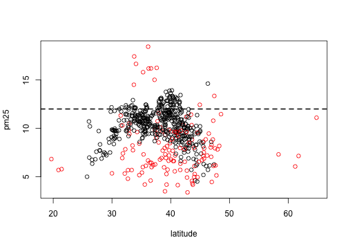

It may be confusing at first to figure out which color gets mapped to which region. We can find out by looking directly at the levels of the `region` variable.

~~~~~~~~
> levels(pollution$region)
[1] "east" "west"
~~~~~~~~

Here we see that the first level is "east" and the second level is "west". So the color for "east" will get mapped to 1 and the color for "west" will get mapped to 2. For plotting functions, `col = 1` is black (the default color) and `col = 2` is red.

## Multiple Scatterplots

Using multiple scatterplots can be necessary when overlaying points with different colors or shapes is confusing (sometimes because of the volume of data). Separating the plots out can sometimes make visualization easier. 

~~~~~~~~
> par(mfrow = c(1, 2), mar = c(5, 4, 2, 1))
> with(subset(pollution, region == "west"), plot(latitude, pm25, main = "West"))
> with(subset(pollution, region == "east"), plot(latitude, pm25, main = "East"))
~~~~~~~~

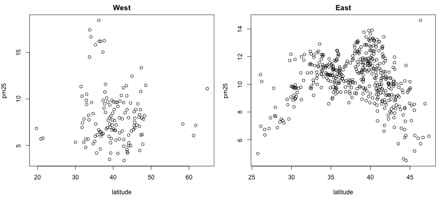

These kinds of plots, sometimes called panel plots, are generally easier to make with either the `lattice` or `ggplot2` system, which we will learn about in greater detail in later chapters..

~~~~~~~~
> ## Lattice
> library(lattice)
> xyplot(pm25 ~ latitude | region, data = pollution)
> 
> ## ggplot2
> library(ggplot2)
> qplot(latitude, pm25, data = pollution, facets = . ~ region)
~~~~~~~~

## Summary

Exploratory plots are "quick and dirty" and their purpose is to let you summarize the data and highlight any broad features. They are also useful for exploring basic questions about the data and for judging the evidence for or against certain hypotheses. Ultimately, they may be useful for suggesting modeling strategies that can be employed in the  "next step" of the data analysis process.

