# The ggplot2 Plotting System: Part 1

The `ggplot2` package in R is an implementation of _The Grammar of Graphics_ as described by Leland Wilkinson in his book. The package was originally written by Hadley Wickham while he was a graduate student at Iowa State University (he still actively maintains the packgae). The package implements what might be considered a third graphics system for R (along with `base` graphics and `lattice`). The package is available from [CRAN](http://cran.r-project.org/package=ggplot2) via `install.packages()`; the latest version of the source can be found on the package's [GitHub Repository](https://github.com/hadley/ggplot2). Documentation of the package can be found at [http://docs.ggplot2.org/current/]()

The grammar of graphics represents an abstraction of graphics ideas and objects. You can think of this as developing the verbs, nouns, and adjectives for data graphics. Developing such a grammar allows for a "theory" of graphics on which to build new graphics and graphics objects. To quote from Hadley Wickham's book on `ggplot2`, we want to "shorten the distance from mind to page". In summary, 

> "...the grammar tells us that a statistical graphic is a __mapping__ from data to __aesthetic__ attributes (colour, shape, size) of __geometric__ objects (points, lines, bars). The plot may also contain statistical transformations of the data and is drawn on a specific coordinate system" -- from _ggplot2_ book

You might ask yourself "Why do we need a grammar of graphics?" Well, for much the same reasons that having a grammar is useful for spoken languages. The grammer allows for a more compact summary of the base components of a language, and it allows us to extend the language and to handle situations that we have not before seen. 

If you think about making a plot with the base graphics system, the plot is constructed by calling a series of functions that either create or annotate a plot. There's no convenient agreed-upon way to describe the plot, except to just recite the series of R functions that were called to create the thing in the first place. In a previous chapter, we described the base plotting system as a kind of "artist's palette" model, where you start with blank "canvas" and build up from there.

For example, consider the following plot made using base graphics.

~~~~~~~~
with(airquality, { 
        plot(Temp, Ozone)
        lines(loess.smooth(Temp, Ozone))
})
~~~~~~~~

How would one describe the creation of this plot? Well, we could say that we called the `plot()` function and then added a loess smoother by calling the `lines()` function on the output of `loess.smooth()`. 

The base plotting system is convenient and it often mirrors how we think of building plots and analyzing data. But a key drawback is that you can’t go back once plot has started (e.g. to adjust margins), so there is in fact a need to plan in advance. Furthermore, it is difficult to "translate" a plot to others because there's no formal graphical language; each plot is just a series of R commands.

Here's the same plot made using `ggplot2`.

~~~~~~~~
library(ggplot2)
ggplot(airquality, aes(Temp, Ozone)) + 
        geom_point() + 
        geom_smooth(method = "loess", se = FALSE)
~~~~~~~~

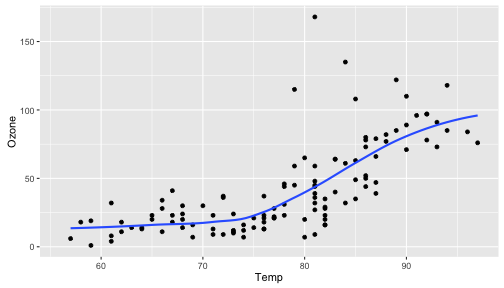

Note that the output is roughly equivalent, and the amount of code is similar, but `ggplot2` allows for a more elegant way of expressing the components of the plot. In this case, the plot is a *dataset* (`airquality`) with *aesthetic mappings* derived from the `Temp` and `Ozone` variables, a set of *points*, and a *smoother*. In a sense, the `ggplot2` system takes many of the cues from the base plotting system and formalizes them a bit. 

The `ggplot2` system also takes some cues from `lattice`. With the `lattice` system, plots are created with a single function call (`xyplot`, `bwplot`, etc.). Things like margins and spacing are set automatically because the entire plot is specified at once. The `lattice` system is most useful for conditioning types of plots and is good for putting many many plots on a screen. That said, it is sometimes awkward to specify an entire plot in a single function call because many different options have to be specified at once. Furthermore, annotation in plots is not intuitive and the use of panel functions and subscripts is difficult to wield and requires intense preparation.

The `ggplot2` system essentially takes the good parts of both the base graphics and lattice graphics system. It automatically handles things like margins and spacing, and also has the concept of "themes" which provide a default set of plotting symbols and colors. While `ggplot2` bears a superficial similarity to `lattice`, `ggplot2` is generally easier and more intuitive to use. The default thems makes many choices for you, but you can customize the presentation if you want.

## The Basics: `qplot()`

The `qplot()` function in `ggplot2` is meant to get you going *q*uickly. It works much like the `plot()` function in base graphics system. It looks for variables to plot within a data frame, similar to lattice, or in the parent environment. In general, it's good to get used to putting your data in a data frame and then passing it to `qplot()`. 

Plots are made up of _aesthetics_ (size, shape, color) and _geoms_ (points, lines). Factors play an important role for indicating subsets of the data (if they are to have different properties) so they should be __labeled__ properly. 
The `qplot()` hides much of what goes on underneath, which is okay for most operations, `ggplot()` is the core function and is very flexible for doing things `qplot()` cannot do.

## Before You Start: Label Your Data

One thing that is always true, but is particularly useful when using `ggplot2`, is that you should always use informative and descriptive labels on your data. More generally, your data should have appropriate *metadata* so that you can quickly look at a dataset and know 

* what the variables are

* what the values of each variable mean

This means that each column of a data frame should have a meaningful (but concise) variable name that accurately reflects the data stored in that column. Also, non-numeric or categorical variables should be coded as factor variables and have meaningful labels for each level of the factor. For example, it's common to code a binary variable as a "0" or a "1", but the problem is that from quickly looking at the data, it's impossible to know whether which level of that variable is represented by a "0" or a "1". Much better to simply label each observation as what they are. If a variable represents temperature categories, it might be better to use "cold", "mild", and "hot" rather than "1", "2", and "3".

While it's sometimes a pain to make sure all of your data are properly labelled, this investment in time can pay dividends down the road when you're trying to figure out what you were plotting. In other words, including the proper metadata can make your exploratory plots essentially self-documenting.

## ggplot2 “Hello, world!”

This example dataset comes with the `ggplot2` package and contains data on the fuel economy of 38 popular models of car from 1999 to 2008.

~~~~~~~~
library(ggplot2)
str(mpg)
~~~~~~~~

~~~~~~~~
tibble [234 × 11] (S3: tbl_df/tbl/data.frame)
 $ manufacturer: chr [1:234] "audi" "audi" "audi" "audi" ...
 $ model       : chr [1:234] "a4" "a4" "a4" "a4" ...
 $ displ       : num [1:234] 1.8 1.8 2 2 2.8 2.8 3.1 1.8 1.8 2 ...
 $ year        : int [1:234] 1999 1999 2008 2008 1999 1999 2008 1999 1999 2008 ...
 $ cyl         : int [1:234] 4 4 4 4 6 6 6 4 4 4 ...
 $ trans       : chr [1:234] "auto(l5)" "manual(m5)" "manual(m6)" "auto(av)" ...
 $ drv         : chr [1:234] "f" "f" "f" "f" ...
 $ cty         : int [1:234] 18 21 20 21 16 18 18 18 16 20 ...
 $ hwy         : int [1:234] 29 29 31 30 26 26 27 26 25 28 ...
 $ fl          : chr [1:234] "p" "p" "p" "p" ...
 $ class       : chr [1:234] "compact" "compact" "compact" "compact" ...
~~~~~~~~

You can see from the `str()` output that all of the factor variables are appropriately coded with meaningful labels. This will come in handy when `qplot()` has to label different aspects of a plot. Also note that all of the columns/variables have meaningful (if sometimes abbreviated) names, rather than names like "X1", and "X2", etc. 

We can make a quick scatterplot of the engine displacement (`displ`) and the highway miles per gallon (`hwy`).

~~~~~~~~
qplot(displ, hwy, data = mpg)
~~~~~~~~

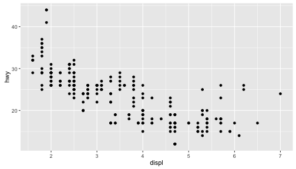

Note that in the call to `qplot()` you must specify the `data` argument so that `qplot()` knows where to look up the variables. 

## Modifying aesthetics

We can introduce a third variable into the plot by modifying the color of the points based on the value of that third variable. Color is an aesthetic and the color of each point can be mapped to a variable. Note that the x-coordinates and y-coordinates are aesthetics too, and they got mapped to the `displ` and `hwy` variables, respectively. In this case we will map the color to the `drv` variable which indicates whether a car is front wheel drive, rear wheel drive, or 4-wheel drive.

~~~~~~~~
qplot(displ, hwy, data = mpg, color = drv)
~~~~~~~~

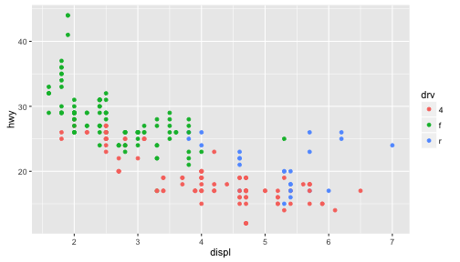

Now we can see that the front wheel drive cars tend to have lower displacement relative to the 4-wheel or rear wheel drive cars. Also, it's clear that the 4-wheel drive cars have the lowest highway gas mileage.

## Adding a geom

Sometimes it's nice to add a smoother to a scatterplot ot highlight any trends. Trends can be difficult to see if the data are very noisy or there are many data points obscuring the view. A smooth is a "geom" that you can add along with your data points.

~~~~~~~~
qplot(displ, hwy, data = mpg, geom = c("point", "smooth"))
~~~~~~~~

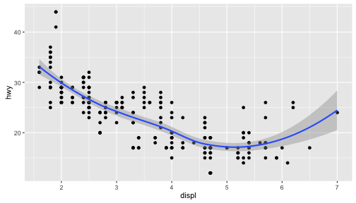

Note that previously, we didn't have to specify `geom = "point"` because that was done automatically. But if you want the smoother overlayed with the points, then you need to specify both explicitly.

Here it seems that engine displacement and highway mileage have a nonlinear U-shaped relationship, but from the previous plot we know that this is largely due to confounding by the drive class of the car.

## Histograms

The `qplot()` function can be used to be used to plot 1-dimensional data too. By specifying a single variable, `qplot()` will by default make a histogram. Here we make a histogram if the highway mileage data and stratify on the drive class. So technically this is three histograms overlayed on top of each other.

~~~~~~~~
qplot(hwy, data = mpg, fill = drv, binwidth = 2)
~~~~~~~~

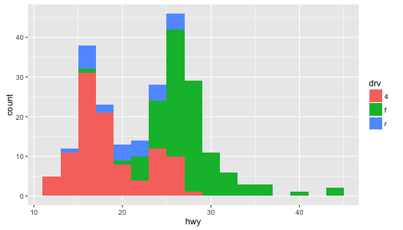

Having the different colors for each drive class is nice, but the three histograms can be a bit difficult to separate out. Side-by-side boxplots is one solution to this problem.

~~~~~~~~
qplot(drv, hwy, data = mpg, geom = "boxplot")
~~~~~~~~

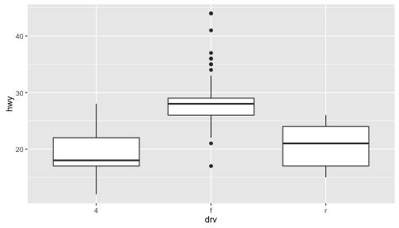

Another solution is to plot the histograms in separate panels using facets.

## Facets

Facets are a way to create multiple panels of plots based on the levels of categorical variable. Here, we want to see a histogram of the highway mileages and the categorical variable is the drive class variable. We can do that using the `facets` argument to `qplot()`. 

The `facets` argument expects a formula type of input, with a `~` separating the left hand side variable and the right hand side variable. The left hand side variable indicates how the rows of the panels should be divided and the right hand side variable indicates how the columns of the panels should be divided. Here, we just want three rows of histograms (and just one column), one for each drive class, so we specify `drv` on the left hand side and `.` on the right hand side indicating that there's no variable there (it's empty).

~~~~~~~~
qplot(hwy, data = mpg, facets = drv ~ ., binwidth = 2)
~~~~~~~~

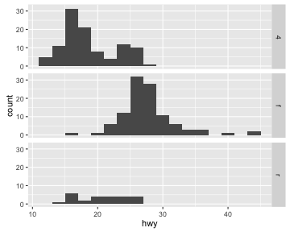

We could also look at more data using facets, so instead of histograms we could look at scatterplots of engine displacement and highway mileage by drive class. Here we put the `drv` variable on the right hand side to indicate that we want a column for each drive class (as opposed to splitting by rows like we did above).

~~~~~~~~
qplot(displ, hwy, data = mpg, facets = . ~ drv)
~~~~~~~~

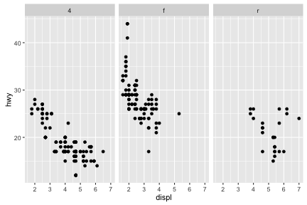

What if you wanted to add a smoother to each one of those panels? Simple, you literally just add the smoother as another geom.

~~~~~~~~
qplot(displ, hwy, data = mpg, facets = . ~ drv) + geom_smooth()
~~~~~~~~

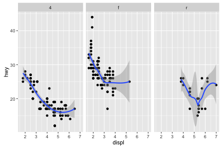

You could have also used the "geom" argument to `qplot()`, as in

~~~~~~~~
qplot(displ, hwy, data = mpg, facets = . ~ drv, geom = c("point", "smooth"))
~~~~~~~~

There's more than one way to do it.

## Case Study: MAACS Cohort

This case study will use data based on the Mouse Allergen and Asthma Cohort Study (MAACS). This study was aimed at characterizing the indoor (home) environment and its relationship with asthma morbidity amonst children aged 5--17 living in Baltimore, MD. The children all had persistent asthma, defined as having had an exacerbation in the past year. A representative publication of results from this study can be found in this paper by [Lu, et al.](http://goo.gl/WqE9j8)

NOTE: Because the individual-level data for this study are protected by various U.S. privacy laws, we cannot make those data available. For the purposes of this chapter, we have simulated data that share many of the same features of the original data, but do not contain any of the actual measurements or values contained in the original dataset.

~~~~~~~~
'data.frame':	750 obs. of  4 variables:
 $ id   : int  1 2 3 4 5 6 7 8 9 10 ...
 $ mopos: chr  "yes" "no" "yes" "no" ...
 $ pm25 : num  6.01 25.17 21.77 13.44 49.39 ...
 $ eno  : num  28.8 17.7 43.6 288.3 7.6 ...
~~~~~~~~

The key variables are:

* `mopos`: an indicator of whether the subject is allergic to mouse allergen (yes/no)

* `pm25`: average level of PM2.5 over the course of 7 days (micrograms per cubic meter)

* `eno`: exhaled nitric oxide

The outcome of interest for this analysis will be exhaled nitric oxide (eNO), which is a measure of pulmonary inflamation. We can get a sense of how eNO is distributed in this population by making a quick histogram of the variable. Here, we take the log of eNO because some right-skew in the data.

~~~~~~~~
qplot(log(eno), data = maacs)
~~~~~~~~

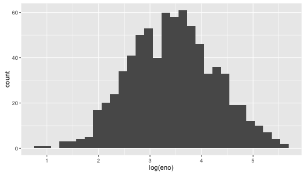

A quick glance suggests that the histogram is a bit "fat", suggesting that there might be multiple groups of people being lumped together. We can stratify the histogram by whether they are allergic to mouse.

~~~~~~~~
qplot(log(eno), data = maacs, fill = mopos)
~~~~~~~~

We can see from this plot that the non-allergic subjects are shifted slightly to the left, indicating a lower eNO and less pulmonary inflammation. That said, there is significant overlap between the two groups.

An alternative to histograms is a density smoother, which sometimes can be easier to visualize when there are multiple groups. Here is a density smooth of the entire study population.

~~~~~~~~
qplot(log(eno), data = maacs, geom = "density")
~~~~~~~~

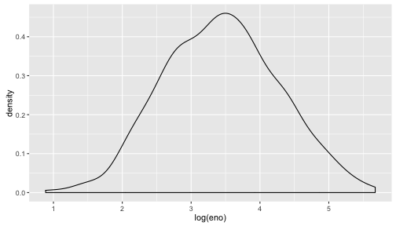

And here are the densities straitified by allergic status. We can map the color aesthetic to the `mopos` variable.

~~~~~~~~
qplot(log(eno), data = maacs, geom = "density", color = mopos)
~~~~~~~~

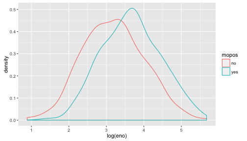

These tell the same story as the stratified histograms, which sould come as no surprise.

Now we can examine the indoor environment and its relationship to eNO. Here, we use the level of indoor PM2.5 as a measure of indoor environment air quality. We can make a simple scatterplot of PM2.5 and eNO.

~~~~~~~~
qplot(log(pm25), log(eno), data = maacs, geom = c("point", "smooth"))
~~~~~~~~

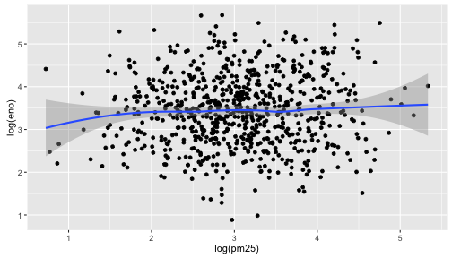

The relationship appears modest at best, as there is substantial noise in the data. However, one question that we might be interested in is whether allergic individuals are prehaps more sensitive to PM2.5 inhalation than non-allergic individuals. To examine that question we can stratify the data into two groups.

This first plot uses different plot symbols for the two groups and overlays them on a single canvas. We can do this by mapping the `mopos` variable to the `shape` aesthetic.

~~~~~~~~
qplot(log(pm25), log(eno), data = maacs, shape = mopos)
~~~~~~~~

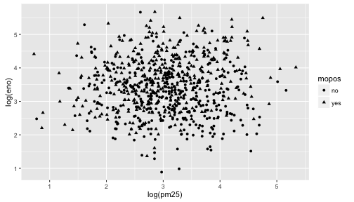

Because there is substantial overlap in the data it is a bit challenging to discern the circles from the triangles. Part of the reason might be that all of the symbols are the same color (black). 

We can plot each group a different color to see if that helps.

~~~~~~~~
qplot(log(pm25), log(eno), data = maacs, color = mopos)
~~~~~~~~

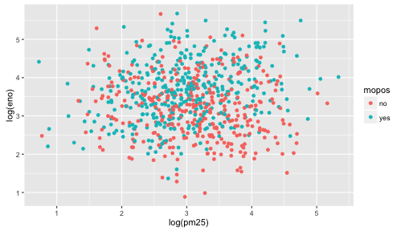

This is slightly better but the substantial overlap makes it difficult to discern any trends in the data. For this we need to add a smoother of some sort. Here we add a linear regression line (a type of smoother) to each group to see if there's any difference.

~~~~~~~~
qplot(log(pm25), log(eno), data = maacs, color = mopos) + geom_smooth(method = "lm")
~~~~~~~~

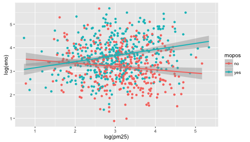

Here we see quite clearly that the red group and the green group exhibit rather different relationships between PM2.5 and eNO. For the non-allergic individuals, there appears to be a slightly negative relationship between PM2.5 and eNO and for the allergic individuals, there is a positive relationship. This suggests a strong interaction between PM2.5 and allergic status, an hypothesis perhaps worth following up on in greater detail than this brief exploratory analysis.

Another, and perhaps more clear, way to visualize this interaction is to use separate panels for the non-allergic and allergic individuals using the `facets` argument to `qplot()`. 

~~~~~~~~
qplot(log(pm25), log(eno), data = maacs, facets = . ~ mopos) + geom_smooth(method = "lm")
~~~~~~~~

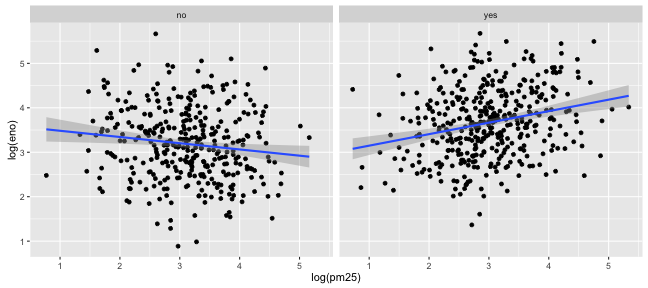

## Summary of qplot()

The `qplot()` function in `ggplot2` is the analog of `plot()` in base graphics but with many built-in features that the traditionaly `plot()` does not provide. The syntax is somewhere in between the base and lattice graphics system. The `qplot()` function is useful for quickly putting data on the page/screen, but for ultimate customization, it may make more sense to use some of the lower level functions that we discuss later in the next chapter.

# The ggplot2 Plotting System: Part 2

In this chapter we'll get into a little more of the nitty gritty of how `ggplot2` builds plots and how you can customize various aspects of any plot. In the previous chapter we used the `qplot()` function to quickly put points on a page. The `qplot()` function's syntax is very similar to that of the `plot()` function in base graphics so for those switching over, it makes for an easy transition. But it's worth knowing the underlying details of how `ggplot2` works so that you can really exploit its power.

## Basic Components of a ggplot2 Plot

A `ggplot2` plot consists of a number of key components. Here are a few of the more commonly used ones.

- A _data frame_: stores all of the data that will be displayed on the plot

- _aesthetic mappings_: describe how data are mapped to color, size, shape, location

- _geoms_: geometric objects like points, lines, shapes. 

- _facets_: describes how conditional/panel plots should be constructed 

- _stats_: statistical transformations like binning, quantiles, smoothing. 

- _scales_: what scale an aesthetic map uses (example: male = red, female = blue). 

- _coordinate system_: describes the system in which the locations of the geoms will be drawn

It's essential that you properly organize your data into a data frame before you start with `ggplot2`. In particular, it's important that you provide all of the appropriate metadata so that your data frame is self-describing and your plots will be self-documenting.

When building plots in ggplot2 (rather than using `qplot()`) the "artist's palette"" model may be the closest analogy. Essentially, you start with some raw data, and then you gradually add bits and pieces to it to create a plot. Plots are built up in layers, with the typically ordering being

1. Plot the data

2. Overlay a summary

3. Add metadata and annotation

For quick exploratory plots you may not get past step 1.

## Example: BMI, PM2.5, Asthma

To demonstrate the various pieces of `ggplot2` we will use a running example from the Mouse Allergen and Asthma Cohort Study (MAACS), which was described in the previous chapter. Here, the question we are interested in is 

> "Are overweight individuals, as measured by body mass index (BMI), more susceptible than normal weight individuals to the harmful effects of PM2.5 on asthma symptoms?"

There is a suggestion that overweight individuals may be more susceptible to the negative effects of inhaling PM2.5. This would suggest that increases in PM2.5 exposure in the home of an overweight child would be more deleterious to his/her asthma symptoms than they would be in the home of a normal weight child. We want to see if we can see that difference in the data from MAACS.

NOTE: Because the individual-level data for this study are protected by various U.S. privacy laws, we cannot make those data available. For the purposes of this chapter, we have simulated data that share many of the same features of the original data, but do not contain any of the actual measurements or values contained in the original dataset.

We can look at the data quickly with `str()`.

~~~~~~~~
maacs <- read.csv("data/bmi_pm25_no2_sim.csv")
str(maacs)
~~~~~~~~

~~~~~~~~
'data.frame':	517 obs. of  4 variables:
 $ logpm25       : num  1.248 1.122 1.93 1.368 0.775 ...
 $ logno2_new    : num  1.184 1.552 1.432 1.774 0.765 ...
 $ bmicat        : chr  "normal weight" "overweight" "normal weight" "overweight" ...
 $ NocturnalSympt: int  1 0 0 2 0 0 0 0 0 3 ...
~~~~~~~~

The outcome we will look at here, `NocturnalSymp`, is the number of days in the past 2 weeks where the child experienced asthma symptoms (e.g. coughing, wheezing) while sleeping.

## Building Up in Layers

First we can create a `ggplot` object that stores the dataset and the basic aesthetics for mapping the x- and y-coordinates for the plot. Here we will eventually be plotting the log of PM2.5 and `NocturnalSymp` variable.

~~~~~~~~
head(maacs)
~~~~~~~~

~~~~~~~~
    logpm25 logno2_new        bmicat NocturnalSympt
1 1.2476997  1.1837987 normal weight              1
2 1.1216476  1.5515362    overweight              0
3 1.9300429  1.4323519 normal weight              0
4 1.3679246  1.7736804    overweight              2
5 0.7753367  0.7654826 normal weight              0
6 1.4872785  1.1127378 normal weight              0
~~~~~~~~

~~~~~~~~
g <- ggplot(maacs, aes(logpm25, NocturnalSympt))
summary(g)
~~~~~~~~

~~~~~~~~
data: logpm25, logno2_new, bmicat, NocturnalSympt [517x4]
mapping:  x = ~logpm25, y = ~NocturnalSympt
faceting: <ggproto object: Class FacetNull, Facet, gg>
    compute_layout: function
    draw_back: function
    draw_front: function
    draw_labels: function
    draw_panels: function
    finish_data: function
    init_scales: function
    map_data: function
    params: list
    setup_data: function
    setup_params: function
    shrink: TRUE
    train_scales: function
    vars: function
    super:  <ggproto object: Class FacetNull, Facet, gg>
~~~~~~~~

~~~~~~~~
class(g)
~~~~~~~~

~~~~~~~~
[1] "gg"     "ggplot"
~~~~~~~~

You can see above that the object `g` contains the dataset `maacs` and the mappings.

Now, normally if you were to `print()` a `ggplot` object a plot would appear on the plot device, however, our object `g` actually doesn't contain enough information to make a plot yet. 

~~~~~~~~
g <- ggplot(maacs, aes(logpm25, NocturnalSympt))
print(g)
~~~~~~~~

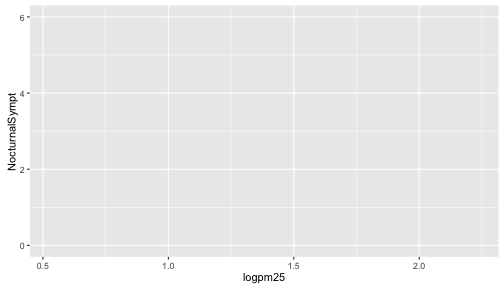

## First Plot with Point Layer

To make a scatterplot we need add at least one *geom*, such as points. Here we add the `geom_point()` function to create a traditional scatterplot.

~~~~~~~~
g <- ggplot(maacs, aes(logpm25, NocturnalSympt))
g + geom_point()
~~~~~~~~

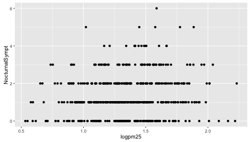

## Adding More Layers: Smooth

Because the data appear rather noisy, it might be better if we added a smoother on top of the points to see if there is a trend in the data with PM2.5.

~~~~~~~~
g + geom_point() + geom_smooth()
~~~~~~~~

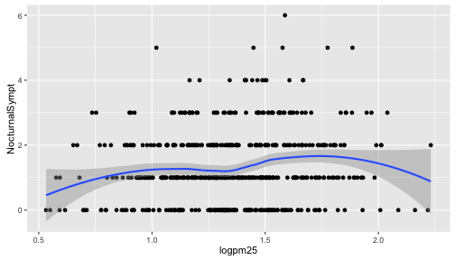

The default smoother is a loess smoother, which is flexible and nonparametric but might be too flexible for our purposes. Perhaps we'd prefer a simple linear regression line to highlight any first order trends. We can do this by specifying `method = "lm"` to `geom_smooth()`.

~~~~~~~~
g + geom_point() + geom_smooth(method = "lm")
~~~~~~~~

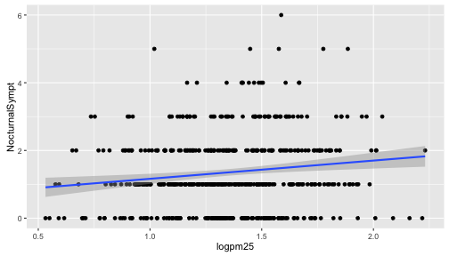

Here, we can see there appears to be a slight increasing trend, suggesting that higher levels of PM2.5 are assocuated with increased days with nocturnal symptoms.

## Adding More Layers: Facets

Because our primary question involves comparing overweight individuals to normal weight individuals, we can stratify the scatterplot of PM2.5 and nocturnal symptoms by the BMI category (`bmicat`) variable, which indicates whether an individual is overweight or now. To visualize this we can add a `facet_grid()`, which takes a formula argument. Here we want one row and two columns, one column for each weight category. So we specify `bmicat` on the right hand side of the forumla passed to `facet_grid()`.

~~~~~~~~
g + geom_point() + 
        geom_smooth(method = "lm") +
        facet_grid(. ~ bmicat) 
~~~~~~~~

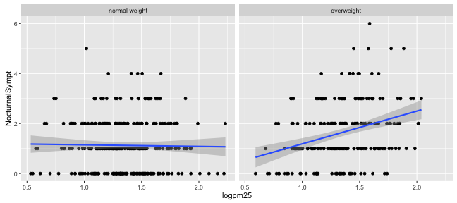

Now it seems clear that the relationship between PM2.5 and nocturnal symptoms is relatively flat amongst normal weight individuals, while the relationship is increasing amongst overweight individuals. This plot suggests that overweight individuals may be more susceptible to the effects of PM2.5.

There are a variety of annotations you can add to a plot, including different kinds of labels. You can use `xlab()` for x-axis labels, `ylab()` for y-axis labels, and `ggtitle()` for specifying plot titles. The `labs()` function is generic and can be used to modify multiple types of labels at once.

For things that only make sense globally, use `theme()`, i.e. `theme(legend.position = "none")`. Two standard appearance themes are included
  
* `theme_gray()`: The default theme (gray background)
  
* `theme_bw()`: More stark/plain 

## Modifying Geom Properties

You can modify properties of geoms by specifying options to their respective `geom_*` functions. For example, here we modify the points in the scatterplot to make the color "steelblue", the size larger , and the alpha transparency greater.

~~~~~~~~
g + geom_point(color = "steelblue", size = 4, alpha = 1/2)
~~~~~~~~

In addition to setting specific geom attributes to constants, we can map aesthetics to variables. So, here, we map the color aesthetic `color` to the variable `bmicat`, so the points will be colored according to the levels of `bmicat`. We use the `aes()` function to indicate this difference from the plot above.

~~~~~~~~
g + geom_point(aes(color = bmicat), size = 4, alpha = 1/2)
~~~~~~~~

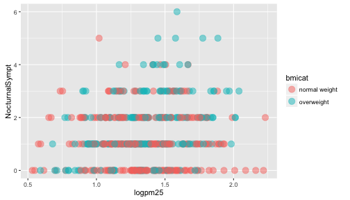

## Modifying Labels

Here is an example of modifying the title and the x and y labels to make the plot a bit more informative.

~~~~~~~~
g + geom_point(aes(color = bmicat)) + 
        labs(title = "MAACS Cohort") + 
        labs(x = expression("log " * PM[2.5]), y = "Nocturnal Symptoms")
~~~~~~~~

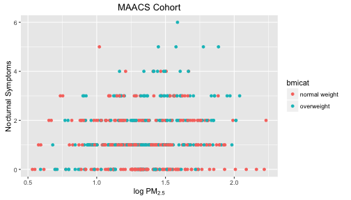

## Customizing the Smooth

We can also customize aspects of the smoother that we overlay on the points with `geom_smooth()`. Here we change the line type and increase the size from the default. We also remove the shaded standard error from the line.

~~~~~~~~
g + geom_point(aes(color = bmicat), size = 2, alpha = 1/2) + 
  geom_smooth(size = 4, linetype = 3, method = "lm", se = FALSE)
~~~~~~~~

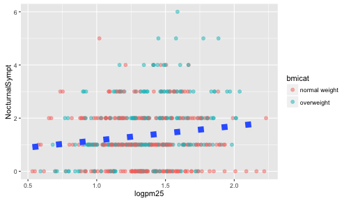

## Changing the Theme

The default theme for `ggplot2` uses the gray background with white grid lines. If you don't find this suitable, you can use the black and white theme by using the `theme_bw()` function. The `theme_bw()` function also allows you to set the typeface for the plot, in case you don't want the default Helvetica. Here we change the typeface to Times.

~~~~~~~~
g + geom_point(aes(color = bmicat)) + theme_bw(base_family = "Times")
~~~~~~~~

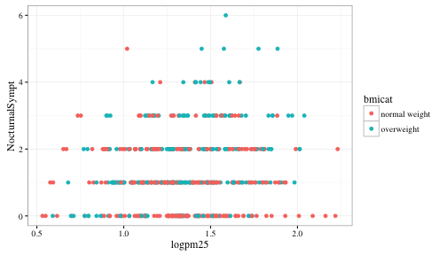

## More Complex Example

Now you get the sense that plots in the `ggplot2` system are constructed by successively adding components to the plot, starting with the base dataset and maybe a scatterplot. In this section we will show a slightly more complicated example with an additional variable. Now, we will ask the question

> How does the relationship between PM2.5 and nocturnal symptoms vary by BMI category and nitrogen dioxide (NO2)?

Unlike our previous BMI variable, NO2 is continuous, and so we need to make NO2 categorical so we can condition on it in the plotting. We can use the `cut()` function for this purpose. We will divide the NO2 variable into tertiles.

First we need to calculate the tertiles with the `quantile()` function.

~~~~~~~~
cutpoints <- quantile(maacs$logno2_new, seq(0, 1, length = 4), na.rm = TRUE)
~~~~~~~~

Then we need to divide the original `logno2_new` variable into the ranges defined by the cut points computed above.

~~~~~~~~
maacs$no2tert <- cut(maacs$logno2_new, cutpoints)
~~~~~~~~

The `not2tert` variable is now a categorical factor variable containing 3 levels, indicating the ranges of NO2 (on the log scale).

~~~~~~~~
## See the levels of the newly created factor variable
levels(maacs$no2tert)
~~~~~~~~

~~~~~~~~
[1] "(0.342,1.23]" "(1.23,1.47]"  "(1.47,2.17]" 
~~~~~~~~

The final plot shows the relationship between PM2.5 and nocturnal symptoms by BMI category and NO2 tertile.

~~~~~~~~
## Setup ggplot with data frame
g <- ggplot(maacs, aes(logpm25, NocturnalSympt))

## Add layers
g + geom_point(alpha = 1/3) + 
  facet_wrap(bmicat ~ no2tert, nrow = 2, ncol = 4) + 
  geom_smooth(method="lm", se=FALSE, col="steelblue") + 
  theme_bw(base_family = "Avenir", base_size = 10) + 
  labs(x = expression("log " * PM[2.5])) + 
  labs(y = "Nocturnal Symptoms") + 
  labs(title = "MAACS Cohort")
~~~~~~~~

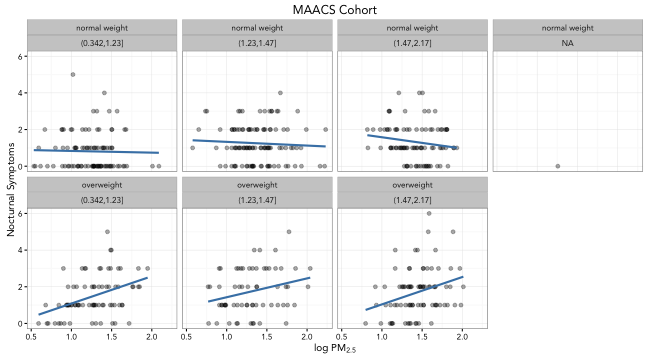

## A Quick Aside about Axis Limits

One quick quirk about `ggplot2` that caught me up when I first started using the package can be displayed in the following example. I make a lot of time series plots and I often want to restrict the range of the y-axis while still plotting all the data. In the base graphics system you can do that as follows.

~~~~~~~~
testdat <- data.frame(x = 1:100, y = rnorm(100))
testdat[50,2] <- 100  ## Outlier!
plot(testdat$x, testdat$y, type = "l", ylim = c(-3,3))
~~~~~~~~

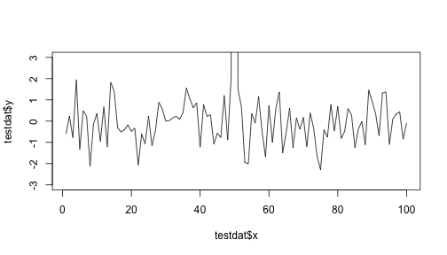

Here I've restricted the y-axis range to be between -3 and 3, even though there is a clear outlier in the data.

With `ggplot2` the default settings will give you this.

~~~~~~~~
g <- ggplot(testdat, aes(x = x, y = y))
g + geom_line()
~~~~~~~~

Modifying the `ylim()` attribute would seem to give you the same thing as the base plot, but it doesn't.

~~~~~~~~
g + geom_line() + ylim(-3, 3)
~~~~~~~~

Effectively, what this does is subset the data so that only observations between -3 and 3 are included, then plot the data. 

To plot the data without subsetting it first and still get the restricted range, you have to do the following.

~~~~~~~~
g + geom_line() + coord_cartesian(ylim = c(-3, 3))
~~~~~~~~

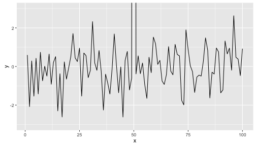

And now you know!

## Resources

- The _ggplot2_ book by Hadley Wickham
- The _R Graphics Cookbook_ by Winston Chang (examples in base plots and in ggplot2)
- ggplot2 web site (http://ggplot2.org)
- ggplot2 mailing list (http://goo.gl/OdW3uB), primarily for developers

