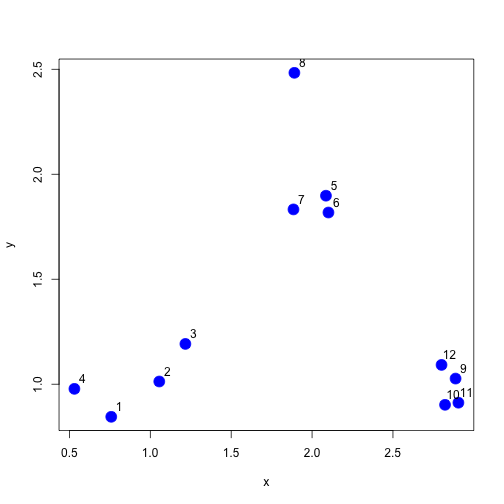
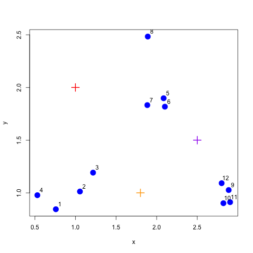
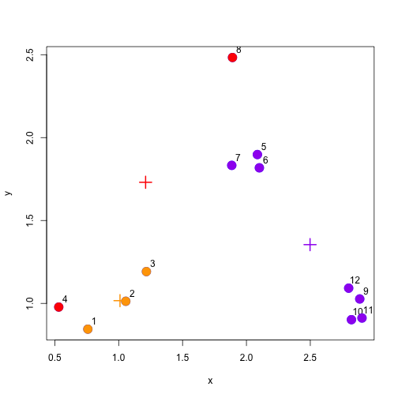
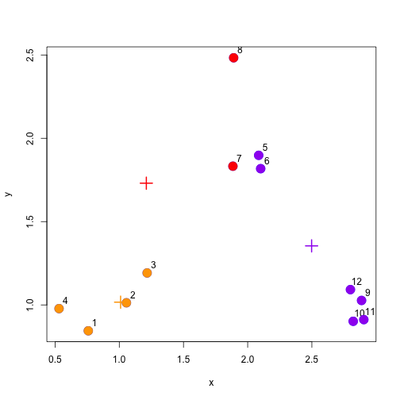
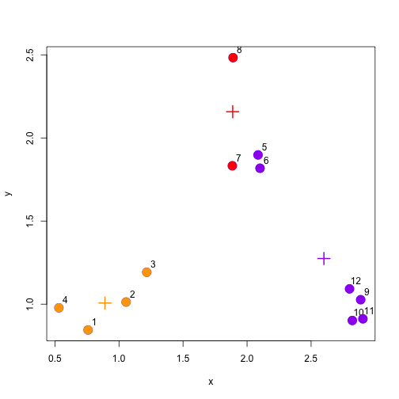
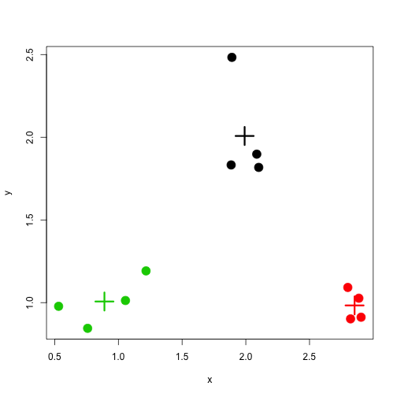
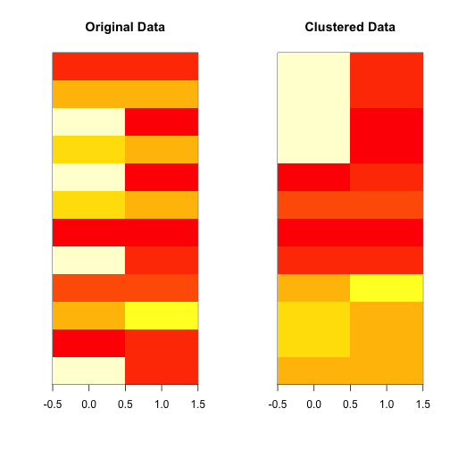

# K-Means Clustering

Watch a video of this chapter: [Part 1](https://youtu.be/QGDuvVRUURA) [Part 2](https://youtu.be/XRlYz1jfCqs)

The K-means clustering algorithm is another bread-and-butter algorithm in high-dimensional data analysis that dates back many decades now (for a comprehensive examination of clustering algorithms, including the K-means algorithm, a classic text is John Hartigan's book *Clustering Algorithms*). 

The K-means approach, like many clustering methods, is highly algorithmic (can't be summarized in a formula) and is iterative. The basic idea is that you are trying to find the centroids of a fixed number of clusters of points in a high-dimensional space. In two dimensions, you can imagine that there are a bunch of clouds of points on the plane and you want to figure out where the centers of each one of those clouds is.

Of course, in two dimensions, you could probably just look at the data and figure out with a high degree of accuracy where the cluster centroids are. But what if the data are in a 100-dimensional space? That's where we need an algorithm.

The K-means approach is a partitioning approach, whereby the data are partitioned into groups at each iteration of the algorithm. One requirement is that you must **pre-specify how many clusters there are**. Of course, this may not be known in advance, but you can guess and just run the algorithm anyway. Afterwards, you can change the number of clusters and run the algorithm again to see if anything changes.

The outline of the algorithm is

1. Fix the number of clusters at some integer greater than or equal to 2

2. Start with the "centroids" of each cluster; initially you might just pick a random set of points as the centroids

3. Assign points to their closest centroid; cluster membership corresponds to the centroid assignment

4. Reclaculate centroid positions and repeat.

This approach, like most clustering methods requires a defined distance metric, a fixed number of clusters, and an initial guess as to the cluster centriods. There's no set approach to determining the initial configuration of centroids, but many algorithms simply randomly select data points from your dataset as the initial centroids.

The K-means algorithm produces

* A final estimate of cluster centroids (i.e. their coordinates)

* An assignment of each point to their respective cluster

  

## Illustrating the K-means algorithm

We will use an example with simulated data to demonstrate how the K-means algorithm works. Here we simulate some data from three clusters and plot the dataset below.

~~~~~~~~
> set.seed(1234)
> x <- rnorm(12, mean = rep(1:3, each = 4), sd = 0.2)
> y <- rnorm(12, mean = rep(c(1, 2, 1), each = 4), sd = 0.2)
> plot(x, y, col = "blue", pch = 19, cex = 2)
> text(x + 0.05, y + 0.05, labels = as.character(1:12))
~~~~~~~~

The first thing K-means has to do is assign an initial set of centroids. For this example, we will assume that there are three clusters (which also happens to be the truth). We will choose three centroids arbitrarily and show them in the plot below.

The next stage in the algorithm assigns every point in the dataset to the closest centroid. In the plot below, we color each point according to the color of its closest centroid (red, purple, or orange).

You can see that this initial clustering incorrectly clusters some points that are truly in the same cluster to separate clusters. The hope is that iterating algorithm more times that we will eventually converge on the correct solution.

The next stage is the re-calculate the centroids based on the new cluster assignments of the data points. The new cluster centroids are shown in the plot below.

Now we have completed one full cycle of the algorithm we can continue and re-assign points to their (new) closest cluster centroid.

And we can update the centroid positions one more time based on the re-assigned points.

We can see from this last plot that things are actually pretty close to where they should be. There are just two purple points that have been assigned to the wrong cluster.

## Stopping the algorithm

In practice, we would not know where the actual clusters were, so we wouldn't necessarily know when we were close to the truth. But eventually our algorithm needs to stop, so how do we decide when to stop iterating?

At some point the cluster centroids will stabilize and stop moving with each iteration. You could see that from the first iteration to the second iteration, the cluster centroids moved a lot. But after the second iteration, they moved less. Between each iteration we can keep track of the distance that each centroid moves from one iteration to the next. Once this distance is relatively small, we can stop the algorithm. 

## Using the `kmeans()` function

The `kmeans()` function in R implements the K-means algorithm and can be found in the `stats` package, which comes with R and is usually already loaded when you start R. Two key parameters that you have to specify are `x`, which is a matrix or data frame of data, and `centers` which is either an integer indicating the number of clusters or a matrix indicating the locations of the initial cluster centroids. The data should be organized so that each row is an observation and each column is a variable or feature of that observation.

~~~~~~~~
> dataFrame <- data.frame(x, y)
> kmeansObj <- kmeans(dataFrame, centers = 3)
> names(kmeansObj)
[1] "cluster"      "centers"      "totss"        "withinss"     "tot.withinss"
[6] "betweenss"    "size"         "iter"         "ifault"      
~~~~~~~~

You can see which cluster each data point got assigned to by looking at the `cluster` element of the list returned by the `kmeans()` function.

~~~~~~~~
> kmeansObj$cluster
 [1] 3 1 1 3 2 2 2 2 2 2 2 2
~~~~~~~~

Here is a plot of the K-means clustering solution. Not surprisingly for this simple dataset, K-means was able to identify the true solution.

## Building heatmaps from K-means solutions

A heat map or image plot is sometimes a useful way to visualize matrix or array data. The idea is that each cell of the image is colored in a manner proportional to the value in the corresponding matrix element. It take a bit of work to get this to look right in R but the result can be very useful, especially for high-dimensional datasets that can be visualized using the simple plots we used above.

First, we need to find the K-means solution.

~~~~~~~~
> set.seed(1234)
> dataMatrix <- as.matrix(dataFrame)[sample(1:12), ]
> kmeansObj <- kmeans(dataMatrix, centers = 3)
~~~~~~~~

Then we can make an image plot using the K-means clusters.

~~~~~~~~
> par(mfrow = c(1, 2))
> image(t(dataMatrix)[, nrow(dataMatrix):1], yaxt = "n", main = "Original Data")
> image(t(dataMatrix)[, order(kmeansObj$cluster)], yaxt = "n", main = "Clustered Data")
~~~~~~~~

The plot above orders the rows of the matrix/image so that all of the rows in the same cluster are grouped together. You can see this with the more homogeneous nature of the coloring in the clustered version of the image.

## Notes and further resources

* [Determining the number of clusters](http://en.wikipedia.org/wiki/Determining_the_number_of_clusters_in_a_data_set)

* [Rafael Irizarry's Distances and Clustering Video](http://www.youtube.com/watch?v=wQhVWUcXM0A)

* [Elements of statistical learning](http://www-stat.stanford.edu/~tibs/ElemStatLearn/)

