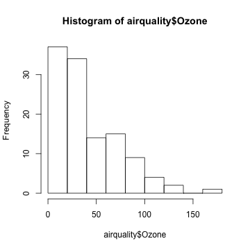
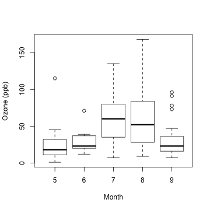
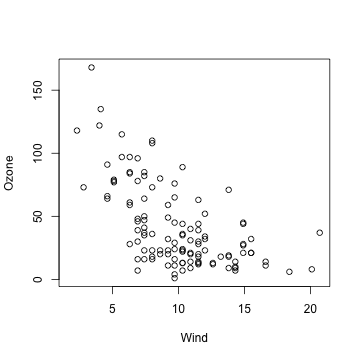
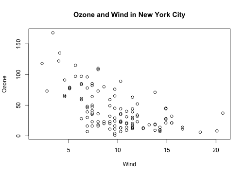
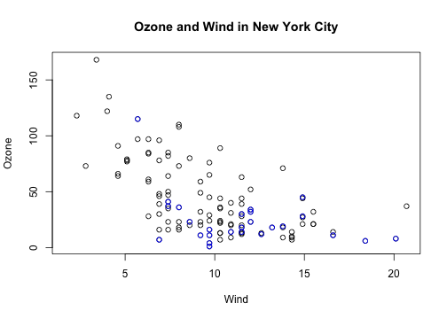
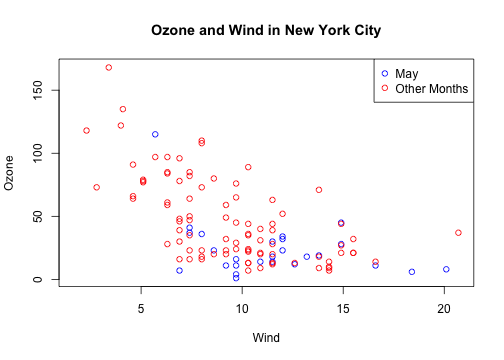
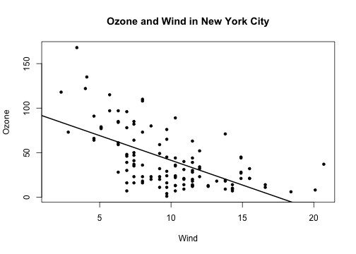
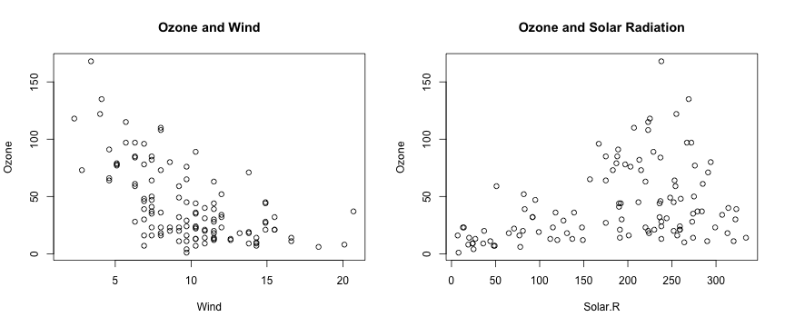
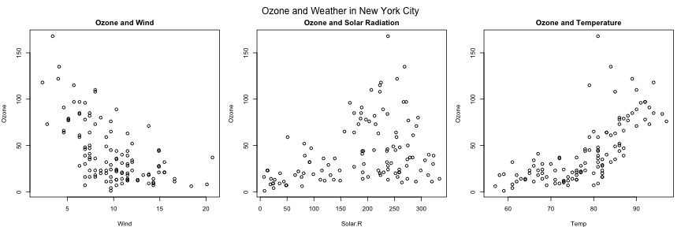

# The Base Plotting System

Watch a video of this chapter: [Part 1](https://youtu.be/AAXh0egb5WM) [Part 2](https://youtu.be/bhyb1gCeAVk)

The core plotting and graphics engine in R is encapsulated in the
following packages:

- `graphics`: contains plotting functions for the "base" graphing
   systems, including `plot`, `hist`, `boxplot` and many others.

- `grDevices`: contains all the code implementing the various graphics
   devices, including X11, PDF, PostScript, PNG, etc.

The `grDevices` package was discussed in the previous chapter and it contains the functionality for sending plots to various output devices. The `graphics` package contains the code for actually constructing and annotating plots.

In this chapter, we focus on using the **base plotting system** to create graphics on
the **screen device**.

## Base Graphics

Base graphics are used most commonly and are a very powerful system for creating data graphics. There are two *phases* to creating a base plot:

1. Initializing a new plot
2. Annotating (adding to) an existing plot

Calling `plot(x, y)` or `hist(x)` will launch a graphics device (if one is not already open) and draw a new plot on the device. If the arguments to `plot` are not of some special class, then the  _default_ method for `plot` is called; this function has _many_  arguments, letting you set the title, x axis label, y axis label,  etc.

The base graphics system has _many_ global parameters that can set and  tweaked. These parameters are documented in `?par` and are used to control the global behavior of plots, such as the margins, axis orientation, and other details. It wouldn’t hurt  to try to memorize at least part of this help page!

## Simple Base Graphics

### Histogram

Here is an example of a simple histogram made using the `hist()` function in the `graphics` package. If you run this code and your graphics window is not already open, it should open once you call the `hist()` function.

~~~~~~~~
> library(datasets)
> 
> ## Draw a new plot on the screen device
> hist(airquality$Ozone)  
~~~~~~~~

### Boxplot

Boxplots can be made in R using the `boxplot()` function, which takes as its first argument a *formula*. The formula has form of `y-axis ~ x-axis`. Anytime you see a `~` in R, it's a formula. Here, we are plotting ozone levels in New York *by month*, and the right hand side of the `~` indicate the month variable. However, we first have to transform the month variable in to a factor before we can pass it to `boxplot()`, or else `boxplot()` will treat the month variable as continuous.

~~~~~~~~
> airquality <- transform(airquality, Month = factor(Month))
> boxplot(Ozone ~ Month, airquality, xlab = "Month", ylab = "Ozone (ppb)")
~~~~~~~~

Each boxplot shows the median, 25th and 75th percentiles of the data (the "box"), as well as +/- 1.5 times the interquartile range (IQR) of the data (the "whiskers"). Any data points beyond 1.5 times the IQR of the data are indicated separately with circles.

In this case the monthly boxplots show some interesting features. First, the levels of ozone tend to be highest in July and August. Second, the *variability* of ozone is also highest in July and August. This phenomenon is common with environmental data where the mean and the variance are often related to each other.

### Scatterplot

Here is a simple scatterplot made with the `plot()` function.

~~~~~~~~
> with(airquality, plot(Wind, Ozone))
~~~~~~~~

Generally, the `plot()` function takes two vectors of numbers: one for the x-axis coordinates and one for the y-axis coordinates. However, `plot()` is what's called a *generic function* in R, which means its behavior can change depending on what kinds of data are passed to the function. We won't go into detail about that behavior for now. The remainder of this chapter will focus on the *default* behavior of the `plot()` function.

One thing to note here is that although we did not provide labels for the x- and the y-axis, labels were automatically created from the *names* of the variables (i.e. "Wind" and "Ozone"). This can be useful when you are making plots quickly, but it demands that you have useful descriptive names for the your variables and R objects. 

## Some Important Base Graphics Parameters

Many base plotting functions share a set of global parameters. Here are a few
key ones:

- `pch`: the plotting symbol (default is open circle)
- `lty`: the line type (default is solid line), can be dashed, dotted, etc.
- `lwd`: the line width, specified as an integer multiple
- `col`: the plotting color, specified as a number, string, or hex
  code; the `colors()` function gives you a vector of colors by name
- `xlab`: character string for the x-axis label
- `ylab`: character string for the y-axis label

The `par()` function is used to specify the *global* graphics parameters
that affect all plots in an R session. These parameters can be
overridden when they are specified as arguments to specific plotting functions.

- `las`: the orientation of the axis labels on the plot
- `bg`: the background color
- `mar`: the margin size
- `oma`: the outer margin size (default is 0 for all sides)
- `mfrow`: number of plots per row, column (plots are filled row-wise) 
- `mfcol`: number of plots per row, column (plots are filled column-wise)

You can see the default values for global graphics parameters by calling the `par()` function and passing the name of the parameter in quotes.

~~~~~~~~
> par("lty")
[1] "solid"
> par("col")
[1] "black"
> par("pch")
[1] 1
~~~~~~~~

Here are some more default values for global graphics parameters.

~~~~~~~~
> par("bg")
[1] "white"
> par("mar")
[1] 5.1 4.1 4.1 2.1
> par("mfrow")
[1] 1 1
~~~~~~~~

For the most part, you usually don't have to modify these when making quick plots. However, you might need to tweak them for finalizing finished plots.

## Base Plotting Functions

The most basic base plotting function is `plot()`. The `plot()` function makes a scatterplot, or other type of plot depending on the class of the object being plotted. Calling `plot()` will draw a plot on the screen device (and open the screen device if not already open). After that, annotation functions can be called to add to the already-made plot.

Some key annotation functions are

- `lines`: add lines to a plot, given a vector of `x` values and a
  corresponding vector of `y` values (or a 2-column matrix); this
  function just connects the dots
- `points`: add points to a plot
- `text`: add text labels to a plot using specified x, y coordinates
- `title`: add annotations to x, y axis labels, title, subtitle, outer margin 
- `mtext`: add arbitrary text to the margins (inner or outer) of the plot 
- `axis`: adding axis ticks/labels

Here's an example of creating a base plot and the adding some annotation. First we make the plot with the `plot()` function and then add a title to the top of the plot with the `title()` function.

~~~~~~~~
> library(datasets)
> 
> ## Make the initial plot
> with(airquality, plot(Wind, Ozone))
> 
> ## Add a title
> title(main = "Ozone and Wind in New York City")  
~~~~~~~~

Here, I start with the same plot as above (although I add the title right away using the `main` argument to `plot()`) and then annotate it by coloring blue the data points corresponding to the month of May.

~~~~~~~~
> with(airquality, plot(Wind, Ozone, main = "Ozone and Wind in New York City"))
> with(subset(airquality, Month == 5), points(Wind, Ozone, col = "blue"))
~~~~~~~~

The following plot colors the data points for the month of May blue and colors all of the other points red. 

Notice that when constructing the initial plot, we use the option `type = "n"` in the call to `plot`(). This is a common paradigm as `plot()` will draw everything in the plot except for the data points inside the plot window. Then you can use annotation functions like `points()` to add data points. So here, we create the plot without drawing the data points, then add the blue points and then add the red points. Finally, we add a legend with the `legend()` function explaining the meaning of the different colors in the plot.

~~~~~~~~
> with(airquality, plot(Wind, Ozone, main = "Ozone and Wind in New York City", type = "n"))
> with(subset(airquality, Month == 5), points(Wind, Ozone, col = "blue"))
> with(subset(airquality, Month != 5), points(Wind, Ozone, col = "red"))
> legend("topright", pch = 1, col = c("blue", "red"), legend = c("May", "Other Months"))
~~~~~~~~

## Base Plot with Regression Line

It's fairly common to make a scatterplot and then want to draw a simple linear regression line through the data. This can be done with the `abline()` function.

Below, we first make the plot (as above). Then we fit a simple linear regression model using the `lm()` function. Here, we try to model Ozone as a function of Wind. Then we take the output of `lm()` and pass it to the `abline()` function which automatically takes the information from the `model` object and calculates the corresponding regression line.

Note that in the call to `plot()` below, we set `pch = 20` to change the plotting symbol to a filled circle.

~~~~~~~~
> with(airquality, plot(Wind, Ozone, main = "Ozone and Wind in New York City", pch = 20))
> 
> ## Fit a simple linear regression model
> model <- lm(Ozone ~ Wind, airquality)
> 
> ## Draw regression line on plot
> abline(model, lwd = 2)
~~~~~~~~

## Multiple Base Plots

Making multiple plots side by side is a useful way to visualize many relationships between variables with static 2-D plots. Often the repetition of data across a single plot window can be a useful way to identify patterns in the data. In order to do this, the `mfrow` and `mfcol` parameters set by the `par()` function are critical.

Both the `mfrow` and `mfcol` parameters take two numbers: the number of rows of plots followed by the number of columns. The multiple plots will be arranged in a matrix-like pattern. The only difference between the two parameters is that if `mfrow` is set, then the plots will be drawn row-wise; if `mfcol` is set, the plots will be drawn column-wise.

In the example below, we make two plots: one of Ozone and Wind and another with Ozone and Solar.R. We set `par(mfrow = c(1, 2))`, which indicates that we one row of plots and two columns of plots.

~~~~~~~~
> par(mfrow = c(1, 2))
> with(airquality, {
+ 	plot(Wind, Ozone, main = "Ozone and Wind")
+ 	plot(Solar.R, Ozone, main = "Ozone and Solar Radiation")
+ })
~~~~~~~~

The example below creates three plots in a row by setting `par(mfrow = c(1, 3))`. Here we also change the plot margins with the `mar` parameter. The various margin parameters, like `mar`, are specified by setting a value for each *side* of the plot. Side 1 is the bottom of the plot, side 2 is the left hand side, side 3 is the top, and side 4 is the right hand side. In the example below we also modify the outer margin via the `oma` parameter to create a little more space for the plots and to place them closer together.

~~~~~~~~
> par(mfrow = c(1, 3), mar = c(4, 4, 2, 1), oma = c(0, 0, 2, 0))
> with(airquality, {
+ 	plot(Wind, Ozone, main = "Ozone and Wind")
+ 	plot(Solar.R, Ozone, main = "Ozone and Solar Radiation")
+ 	plot(Temp, Ozone, main = "Ozone and Temperature")
+ 	mtext("Ozone and Weather in New York City", outer = TRUE)
+ })
~~~~~~~~

In the above example, the `mtext()` function was used to create an overall title for the panel of plots. Hence, each individual plot has a title, while the overall set of plots also has a summary title. The `mtext()` function is important for adding text annotations that aren't specific to a single plot.

## Summary

* Plots in the base plotting system are created by calling successive
  R functions to "build up" a plot

* Plotting occurs in two stages:

        - Creation of a plot
        - Annotation of a plot (adding lines, points, text, legends)

* The base plotting system is very flexible and offers a high degree
  of control over plotting
