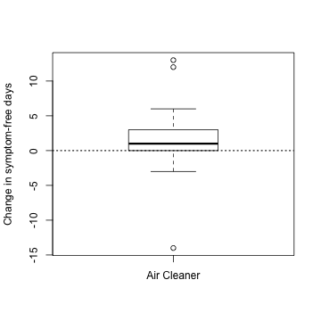
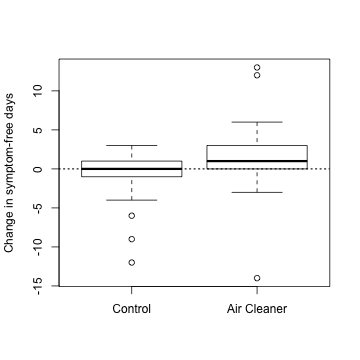
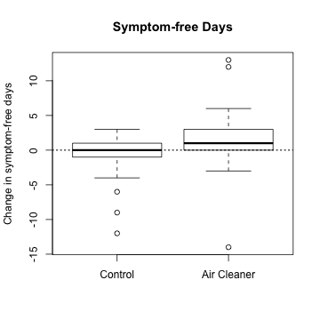
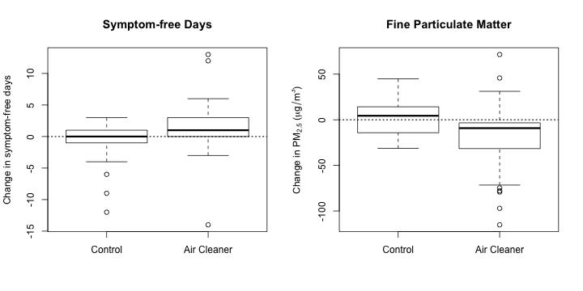
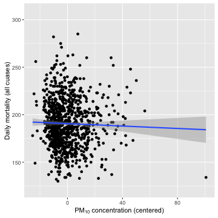
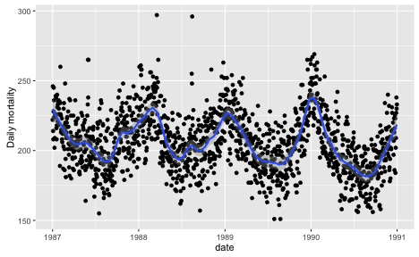
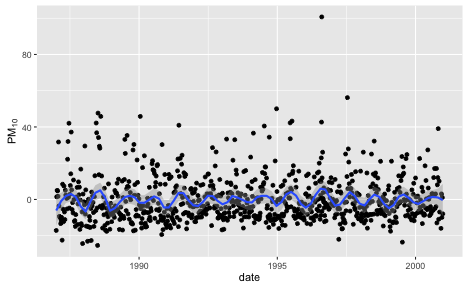
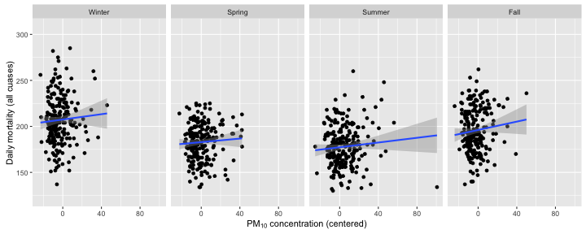
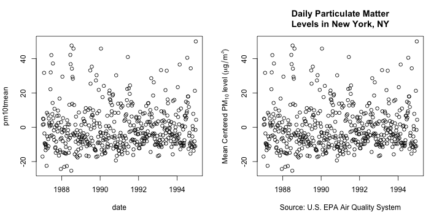

# Principles of Analytic Graphics

[Watch a video of this chapter](https://youtu.be/6lOvA_y7p7w).

The material for this chapter is inspired by Edward Tufte's wonderful book *Beautiful Evidence*, which I strongly encourage you to buy if you are able. He discusses how to make informative and useful data graphics and lays out six principles that are important to achieving that goal. Some of these principles are perhaps more relevant to making "final" graphics as opposed to more "exploratory" graphics, but I believe they are all important principles to keep in mind. 

## Show comparisons

Showing comparisons is really the basis of all good scientific investigation. Evidence for a hypothesis is always *relative* to another competing hypothesis. When you say "the evidence favors hypothesis A", what you mean to say is that "the evidence favors hypothesis A versus hypothesis B". A good scientist is always asking "Compared to What?" when confronted with a scientific claim or statement. Data graphics should generally follow this same principle. You should always be comparing at least two things. 

For example, take a look at the plot below. This plot shows the change in symptom-free days in a group of children enrolled in a [clinical trial](http://www.ncbi.nlm.nih.gov/pubmed/21810636) testing whether an air cleaner installed in a child's home improves their asthma-related symptoms. This study was conducted at the Johns Hopkins University School of Medicine and was conducted in homes where a smoker was living for at least 4 days a week. Each child was assessed at baseline and then 6-months later at a second visit. The aim was to improve a child's symptom-free days over the 6-month period. In this case, a higher number is better, indicating that they had *more* symptom-free days.

There were 47 children who received the air cleaner, and you can see from the boxplot that on average the number of symptom-free days increased by about 1 day (the solid line in the middle of the box is the median of the data).

But the question of "compared to what?" is not answered in this plot. In particular, we don't know from the plot what would have happened if the children had *not* received the air cleaner. But of course, we do have that data and we can show both the group that received the air cleaner and the control group that did not.

Here we can see that on average, the control group children changed very little in terms of their symptom free days. Therefore, *compared to children who did not receive an air cleaner*, children receiving an air cleaner experienced improved asthma morbidity.

## Show causality, mechanism, explanation, systematic structure 

If possible, it's always useful to show your causal framework for thinking about a question. Generally, it's difficult to prove that one thing causes another thing even with the most carefully collected data. But it's still often useful for your data graphics to indicate what you are thinking about in terms of cause. Such a display may suggest hypotheses or refute them, but most importantly, they will raise new questions that can be followed up with new data or analyses.

In the plot below, which is reproduced from the previous section, I show the change in symptom-free days for a group of children who received an air cleaner and a group of children who received no intervention.

From the plot, it seems clear that on average, the group that received an air cleaner experienced improved asthma morbidity (more symptom-free days, a good thing). 

An interesting question might be "Why do the children with the air cleaner improve?" This may not be the *most* important question---you might just care that the air cleaners help things---but answering the question of "why?" might lead to improvements or new developments.

The hypothesis behind air cleaners improving asthma morbidity in children is that the air cleaners remove airborne particles from the air. Given that the homes in this study all had smokers living in them, it is likely that there is a high level of particles in the air, primarily from second-hand smoke. 

It's fairly well-understood that inhaling fine particles can exacerbate asthma symptoms, so it stands to reason that reducing the presence in the air should improve asthma symptoms. Therefore, we'd expect that *the group receiving the air cleaners* should on average see a decrease in airborne particles. In this case we are tracking *fine particulate matter*, also called PM2.5 which stands for particulate matter less than or equal to 2.5 microns in aerodynamic diameter.

In the plot below, you can see both the change in symptom-free days for both groups (left) and the change in PM2.5 in both groups (right).

Now we can see from the right-hand plot that on average in the control group, the level of PM2.5 actually increased a little bit while in the air cleaner group the levels decreased on average. This pattern shown in the plot above is consistent with the idea that air cleaners improve health by reducing airborne particles. However, it is not conclusive proof of this idea because there may be other unmeasured confounding factors that can lower levels of PM2.5 and improve symptom-free days.

## Show multivariate data

The real world is multivariate. For anything that you might study, there are usually many attributes that you can measure. The point is that data graphics should attempt to show this information as much as possible, rather than reduce things down to one or two features that we can plot on a page. There are a variety of ways that you can show multivariate data, and you don't need to wear 3-D glasses to do it.

Here is just a quick example. Below is data on daily airborne particulate matter ("PM10") in New York City and mortality from 1987 to 2000. Each point on the plot represents the average PM10 level for that day (measured in micrograms per cubic meter) and the number of deaths on that day. The PM10 data come from the U.S. Environmental Protection Agency and the mortality data come from the U.S. National Center for Health Statistics.

This is a bivariate plot showing two variables in this dataset. From the plot it seems that there is a slight negative relationship between the two variables. That is, higher daily average levels of PM10 appear to be associated with lower levels of mortality (fewer deaths per day). 

However, there are other factors that are associated with both mortality and PM10 levels. One example is the season. It's well known that mortality tends to be higher in the winter than in the summer. That can be easily shown in the following plot of mortality and date.

Similarly, we can show that in New York City, PM10 levels tend to be high in the summer and low in the winter. Here's the plot for daily PM10 over the same time period. Note that the PM10 data have been centered (the overall mean has been subtracted from them) so that is why there are both positive and negative values.

From the two plots we can see that PM10 and mortality have opposite seasonality with mortality being high in the winter and PM10 being high in the summer. What happens if we plot the relationship between mortality and PM10 *by season*? That plot is below.

Interestingly, before, when we plotted PM10 and mortality by itself, the relationship appeared to be slightly negative. However, in each of the plots above, the relationship is slightly positive. This set of plots illustrates the effect of confounding by season, because season is related to both PM10 levels and to mortality counts, but in different ways for each one. 

This example illustrates just one of many reasons why it can be useful to plot multivariate data and to show as many features as intelligently possible. In some cases, you may uncover unexpected relationships depending on how they are plotted or visualized.

## Integrate evidence

Just because you may be making data graphics, doesn't mean you have to rely solely on circles and lines to make your point. You can also include printed numbers, words, images, and diagrams to tell your story. In other words, data graphics should make use of many modes of data presentation simultaneously, not just the ones that are familiar to you or that the software can handle. One should never let the tools available drive the analysis; one should integrate as much evidence as possible on to a graphic as possible.

## Describe and document the evidence 

Data graphics should be appropriately documented with labels, scales, and sources. A general rule for me is that a data graphic should tell a complete story all by itself. You should not have to refer to extra text or descriptions when interpreting a plot, if possible. Ideally, a plot would have all of the necessary descriptions attached to it. You might think that this level of documentation should be reserved for "final" plots as opposed to exploratory ones, but it's good to get in the habit of documenting your evidence sooner rather than later.

Imagine if you were writing a paper or a report, and a data graphic was presented to make the primary point. Imagine the person you hand the paper/report to has very little time and will only focus on the graphic. Is there enough information on that graphic for the person to get the story? While it is certainly possible to be too detailed, I tend to err on the side of more information rather than less. 

In the simple example below, I plot the same data twice (this is the PM10 data from the previous section of this chapter). 

The plot on the left is a default plot generated by the `plot` function in R. The plot on the right uses the same `plot` function but adds annotations like a title, y-axis label, x-axis label. Key information included is where the data were collected (New York), the units of measurement, the time scale of measurements (daily), and the source of the data (EPA).

## Content, Content, Content

Analytical presentations ultimately stand or fall depending on the quality, relevance, and integrity of their content. This includes the question being asked and the evidence presented in favor of certain hypotheses. No amount of visualization magic or bells and whistles can make poor data, or more importantly, a poorly formed question, shine with clarity. Starting with a good question, developing a sound approach, and only presenting information that is necessary for answering that question, is essential to every data graphic.

## References

This chapter is inspired by the work of Edward Tufte. I encourage you to take a look at his books, in particular the following book:

> Edward Tufte (2006). *Beautiful Evidence*, Graphics Press LLC. [www.edwardtufte.com](http://www.edwardtufte.com)
